# Curso de HTML5

## Introducción

Este curso te enseñará los fundamentos de HTML5. La información presentada en este curso se basa en la excelente documentación de Mozilla Developer Network (https://developer.mozilla.org/).

HTML es la tecnología que define el contenido y la estructura de cualquier sitio web. Si se escribe correctamente, también debería definir la semántica (el significado) del contenido de forma legible por máquina, lo que es vital para la accesibilidad, la optimización de los motores de búsqueda y el uso de las funciones integradas que ofrecen los navegadores para que el contenido funcione de forma óptima.

## ¿Qué es HTML?
HTML (HyperText Markup Language) es un lenguaje de marcado que indica a los navegadores web cómo estructurar las páginas web que visita. Puede ser tan complicado o tan simple como desee el desarrollador web.


### Nota
 > Las etiquetas en HTML no distinguen entre mayúsculas y minúsculas. Esto significa que > pueden escribirse en mayúsculas o minúsculas. Sin embargo, se recomienda escribir    > todas las etiquetas en minúsculas para mantener la coherencia y facilitar la lectura.


# Anatomía de un elemento HTML

* Etiqueta de apertura: consta del nombre del elemento (en este ejemplo, p de párrafo), entre corchetes angulares de apertura y cierre. Esta etiqueta de apertura marca el inicio del elemento o el comienzo de su efecto. En este ejemplo, precede al inicio del texto del párrafo.

* El contenido: es el contenido del elemento. En este ejemplo, es el texto del párrafo.

* Etiqueta de cierre: es igual que la etiqueta de apertura, excepto que incluye una barra diagonal antes del nombre del elemento. Esto marca dónde termina el elemento. No incluir una etiqueta de cierre es un error común de principiantes que puede producir resultados peculiares.

El elemento es la etiqueta de apertura, seguida del contenido, seguido de la etiqueta de cierre.


# Elementos anidados
Los elementos se pueden colocar dentro de otros elementos. Esto se llama anidamiento . Si quisiéramos decir que nuestro gato está muy gruñón, podríamos incluir la palabra muy en un `<strong>` elemento, lo que significa que la palabra debe tener un formato de texto más fuerte:

html
```html
<p>My cat is <strong>very</strong> grumpy.</p>
```
Hay una forma correcta y otra incorrecta de realizar la anidación. abrimos el pelemento primero y luego abrimos el strongelemento. Para una anidación adecuada, debemos cerrar el strongelemento primero, antes de cerrar el p.

El siguiente es un ejemplo de la forma incorrecta de realizar la anidación:

html
```html
<p>My cat is <strong>very grumpy.</p></strong> ❌
```
Las etiquetas deben abrirse y cerrarse de manera que queden dentro o fuera una de la otra .
el navegador debe adivinar cuál es su intención. Este tipo de adivinación puede generar resultados inesperados.

# Elementos vacíos
No todos los elementos siguen el patrón de una etiqueta de apertura, una de contenido y una de cierre. Algunos elementos constan de una sola etiqueta, que normalmente se utiliza para insertar o incrustar algo en el documento. Dichos elementos se denominan elementos void . Por ejemplo, el `` elemento incrusta un archivo de imagen en una página:

```html

```

Esto produciría el siguiente resultado:


 # Nota: 
 > En HTML, no es necesario agregar un /al final de la etiqueta de un elemento void, por > ejemplo: ``.

# Atributos
 Los elementos también pueden tener atributos. Los atributos tienen el siguiente aspecto:

 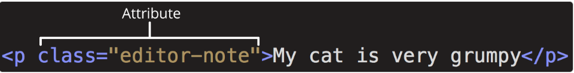

 Los atributos contienen información adicional sobre el elemento que no aparecerá en el contenido. En este ejemplo, el classatributo es un nombre de identificación que se utiliza para identificar el elemento con información de estilo.

Un atributo debe tener:

 Un espacio entre este y el nombre del elemento. (Para un elemento con más de un atributo, los atributos también deben estar separados por espacios).
 El nombre del atributo, seguido de un signo igual.
 Un valor de atributo, entre comillas de apertura y cierre.

# Atributos booleanos
 A veces verás atributos escritos sin valores. Esto es completamente aceptable. Estos se llaman atributos booleanos . Cuando un atributo booleano se escribe sin un valor, o con cualquier valor, incluso como "false", el atributo booleano siempre se establece en verdadero. De lo contrario, si el atributo no está escrito en una etiqueta HTML, el atributo se establece en falso. La especificación requiere que el valor del atributo sea una cadena vacía (incluso cuando el atributo no tiene un valor especificado explícitamente) o el mismo que el nombre del atributo, pero otros valores funcionan de la misma manera.

 La presencia de un atributo booleano en estado verdadero (como "false", "0", o incluso una cadena vacía '') en un elemento HTML siempre lo activa , sin importar el contenido que tenga dentro (incluso si está vacío).

 La ausencia del atributo es lo único que lo considera como falso.
 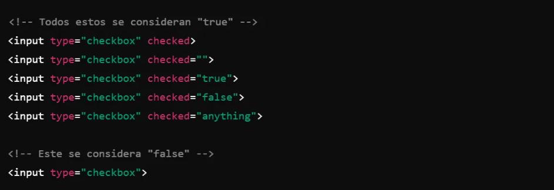


# Omitir comillas alrededor de los valores de los atributos
 Si observa el código de muchos otros sitios, puede encontrar varios estilos de marcado extraños, incluidos valores de atributos sin comillas. Esto está permitido en determinadas circunstancias, pero también puede dañar su marcado en otras circunstancias. El elemento en el fragmento de código a continuación, `<a>`, se llama ancla. Las anclas encierran texto y lo convierten en enlaces. El hrefatributo especifica la dirección web a la que apunta el enlace. Puede escribir esta versión básica a continuación solo con el hrefatributo, de esta manera:
 
 ```html
 <a href=https://www.mozilla.org/>favorite website</a>
```

 Los anclajes también pueden tener un titleatributo, una descripción de la página enlazada. Sin embargo, tan pronto como los agregamos titlede la misma manera que el hrefatributo, surgen problemas:

```html
 <a href=https://www.mozilla.org/ title=The Mozilla homepage>favorite website</a>
```

 Como se escribió anteriormente, el navegador malinterpreta el marcado, confundiendo el titleatributo con tres atributos: un atributo de título con el valor The, y dos atributos booleanos, Mozillay homepage. Obviamente, esto no es intencional. Provocará errores o un comportamiento inesperado, como puede ver en el ejemplo en vivo a continuación. 
 
 #### Incluya siempre las comillas de los atributos. Esto evita este tipo de problemas y da como resultado un código más legible.


# ¿Comillas simples o dobles?
 En este artículo, también notarás que los atributos están entre comillas dobles. Sin embargo, es posible que veas comillas simples en algún código HTML. Esto es una cuestión de estilo. Puedes elegir libremente la que prefieras. Ambas líneas son equivalentes:
```html
 <a href='https://www.example.com'>A link to my example.</a>

 <a href="https://www.example.com">A link to my example.</a>
```
 #### Asegúrese de no mezclar comillas simples y dobles. 

 Para utilizar comillas dentro de otras comillas del mismo tipo (comillas simples o comillas dobles), utilice referencias de caracteres . Lo veremos mas adelante.


# Anatomía de un documento HTML
Los elementos HTML individuales no son muy útiles por sí solos. A continuación, examinemos cómo se combinan los elementos individuales para formar una página HTML completa:
```html
<!doctype html>
<html lang="en-US">
  <head>
    <meta charset="utf-8" />
    <title>My test page</title>
  </head>
  <body>
    <p>This is my page</p>
  </body>
</html>
```
Aquí tenemos:
 `<!DOCTYPE html>` no es una etiqueta HTML, sino una declaración que asegura que los navegadores interpretan tu documento correctamente y en modo estándar, ayudando a garantizar un comportamiento predecible en todos los navegadores modernos.

 `<html></html>`: El `<html>` elemento. Este elemento envuelve todo el contenido de la página. A veces se lo conoce como elemento raíz.

 `<head></head>`: El `<head>` elemento. Este elemento actúa como un contenedor para todo lo que desea incluir en la página HTML, que no sea el contenido que la página mostrará a los visitantes.

 `<meta charset="utf-8">`: El elemento `<meta>` es una etiqueta que proporciona metadatos sobre el documento HTML, es decir, información que no se muestra directamente en la página, pero que es importante para los navegadores y motores de búsqueda. El atributo especifica la codificación de caracteres para su documento como UTF-8, que incluye la mayoría de los caracteres de la gran mayoría de los idiomas escritos por humanos. Con esta configuración, la página ahora puede manejar cualquier contenido textual que pueda contener

```html
 <title></title>: El <title>elemento. Establece el título de la página, que es el título que aparece en la pestaña del navegador en la que se carga la página.

 <body></body>: El <body>elemento. Contiene todo el contenido que se muestra en la página, incluidos texto, imágenes, videos, juegos, pistas de audio reproducibles y cualquier otra cosa.
```

# Espacios en blanco en HTML
En los ejemplos anteriores, es posible que hayas notado que se incluyen muchos espacios en blanco en el código. Esto es opcional. Estos dos fragmentos de código son equivalentes:
 
 ```html
 <p id="noWhitespace">Dogs are silly.</p>

 <p id="whitespace">Dogs
    are
        silly.</p>
 ```
 No importa cuánto espacio en blanco utilices dentro del contenido de un elemento HTML (que puede incluir uno o más caracteres de espacio, pero también saltos de línea), el analizador HTML reduce cada secuencia de espacios en blanco a un solo espacio al representar el código. Entonces, ¿por qué utilizar tanto espacio en blanco? La respuesta es la legibilidad.

 Puede resultar más fácil comprender lo que sucede en su código si lo tiene bien formateado. En nuestro HTML, cada elemento anidado tiene una sangría de dos espacios más que el que se encuentra dentro. Usted decide el estilo de formato cuántos espacios para cada nivel de sangría.

 Veamos cómo el navegador representa los dos párrafos anteriores con y sin espacios en blanco:

 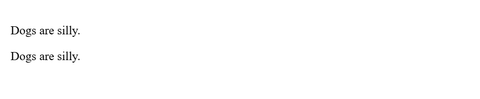


# Referencias de caracteres: incluir caracteres especiales en HTML
 En HTML, los caracteres <, >, ", 'y &son caracteres especiales. Forman parte de la sintaxis HTML en sí. ¿Cómo se incluye uno de estos caracteres especiales en el texto? Por ejemplo, si se desea utilizar un signo & o un signo menor que, sin que se interprete como código.

 Para ello, se utilizan referencias de caracteres . Se trata de códigos especiales que representan caracteres y que se utilizan en estas circunstancias concretas. Cada referencia de carácter comienza con un ampersand (&) y termina con un punto y coma (;).

 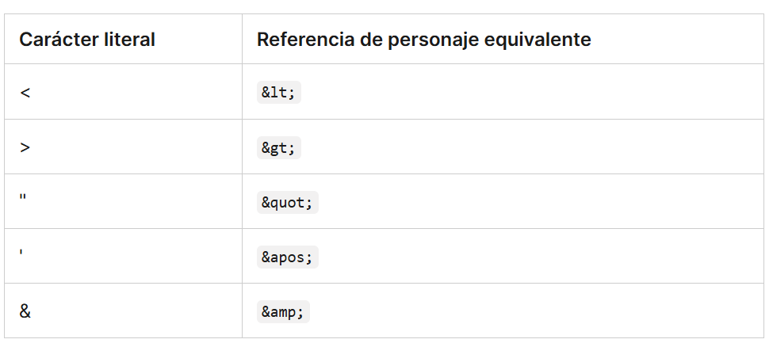
 
 En el siguiente ejemplo, hay dos párrafos:

```html
 <p>In HTML, you define a paragraph using the <p> element.</p>

 <p>In HTML, you define a paragraph using the &lt;p&gt; element.</p>
```
 En la salida en vivo que se muestra a continuación, puede ver que el primer párrafo está mal. El navegador interpreta la segunda instancia de `<p>` como el inicio de un nuevo párrafo. El segundo párrafo se ve bien porque tiene corchetes angulares con referencias de caracteres.

 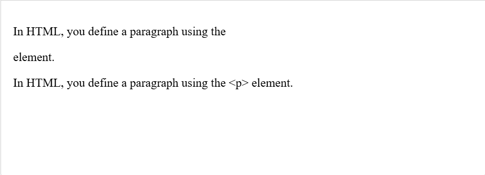

 Nota: No es necesario utilizar referencias de entidad para ningún otro símbolo, ya que los navegadores modernos manejarán los símbolos reales sin problemas siempre que la codificación de caracteres de su HTML esté configurada en UTF-8 .


# Comentarios HTML
 HTML tiene un mecanismo para escribir comentarios en el código. Los navegadores ignoran los comentarios, lo que hace que sean invisibles para el usuario. El propósito de los comentarios es permitirle incluir notas en el código para explicar su lógica o codificación. 

 Para escribir un comentario HTML, enciérrelo entre los marcadores especiales `<!--y -->`. Por ejemplo:

```html
 <p>I'm not inside a comment</p>

 <!-- <p>I am!</p> -->
```

 Como puede ver a continuación, solo se muestra el primer párrafo en la salida en vivo.
 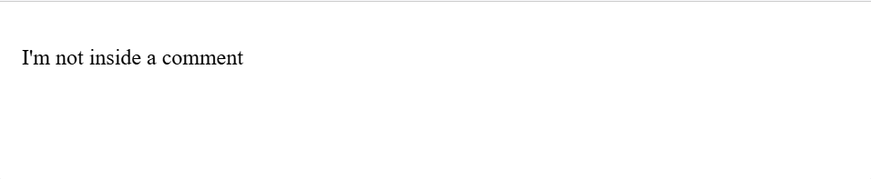

# ¿Qué hay en el Head? Metadatos de la página web
 El encabezado de un documento HTML es la parte que no se muestra en el navegador web cuando se carga la página. Contiene información de metadatos, como la página `<title>`, enlaces a CSS, enlaces a faviconos personalizados y otros metadatos (datos sobre el HTML, como el autor y palabras clave importantes que describen el documento).

 Los navegadores web utilizan la información contenida en el encabezado para representar correctamente el documento HTML. 

 # ¿Qué es el encabezado HTML?
  El encabezado HTML es el contenido del `<head>` elemento. A diferencia del contenido del `<body>` elemento (que se muestra en la página cuando se carga en un navegador), el contenido del encabezado no se muestra en la página. En cambio, la función del encabezado es contener metadatos sobre el documento.

```html
     <head>
        <meta charset="utf-8" />
        <title>My test page</title>
     </head>
```
 Sin embargo, en páginas más grandes, el encabezado puede llegar a ser bastante grande. 

# Agregar un título

 El `<title>` elemento son metadatos que representan el título del documento HTML general (no el contenido del documento).

 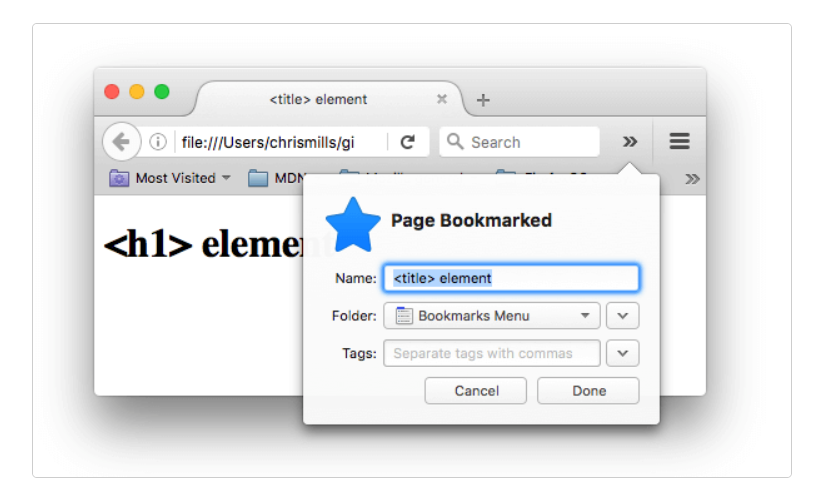

 Los `<title>`contenidos también se utilizan en los resultados de búsqueda, como verás a continuación.


# Metadatos: el <meta>elemento
 Los metadatos son datos que describen datos, y HTML tiene una forma "oficial" de agregar metadatos a un documento: el `<meta>` elemento. Por supuesto, el resto de elementos de los que hablamos en este artículo también se pueden considerar metadatos. Hay muchos tipos diferentes de `<meta>` elementos que se pueden incluir en el archivo de tu página `<head>`, pero no intentaremos explicarlos todos en esta etapa, ya que sería demasiado confuso.

 Cómo especificar la codificación de caracteres de su documento
 En el ejemplo que vimos arriba, se incluyó esta línea:

 ```html
 <meta charset="utf-8" />
 ```

 Este elemento especifica la codificación de caracteres del documento, es decir, el conjunto de caracteres que el documento puede utilizar. utf-8es un conjunto de caracteres universal que incluye prácticamente cualquier carácter de cualquier idioma. Esto significa que su página web podrá mostrar cualquier idioma, por lo que es una buena idea configurarlo en todas las páginas web que cree. 
 
 Nota: algunos navegadores (como Chrome) corrigen automáticamente las codificaciones incorrectas, por lo que, según el navegador que uses, es posible que no veas este problema. De todas formas, debes configurar una codificación `utf-8` en tu página para evitar posibles problemas en otros navegadores.

# Aprendizaje activo: Experimente con la codificación de caracteres

 Agregar un autor y una descripción
Muchos `<meta>` elementos incluyen namey contentatribuyen:

 name: especifica el tipo de metaelemento que es; qué tipo de información contiene.
 conten: tespecifica el contenido meta real.
 Dos de estos metaelementos que son útiles para incluir en tu página definen el autor de la página y brindan una descripción concisa de la misma. Veamos un ejemplo:
```html
<meta name="author" content="Chris Mills" />
<meta
  name="description"
  content="The MDN Web Docs Learning Area aims to provide
complete beginners to the Web with all they need to know to get
started with developing websites and applications." />
```

 Especificar un autor es beneficioso de muchas maneras: es útil para saber quién escribió la página, si tienes alguna pregunta sobre el contenido y te gustaría contactarlo. Algunos sistemas de administración de contenido tienen funciones para extraer automáticamente la información del autor de la página y ponerla a disposición para tales fines.

 Especificar una descripción que incluya palabras clave relacionadas con el contenido de su página es útil ya que tiene el potencial de hacer que su página aparezca más arriba en las búsquedas relevantes realizadas en los motores de búsqueda (estas actividades se denominan Optimización de motores de búsqueda o SEO ).

# Aprendizaje activo: El uso de la descripción en los buscadores
La descripción también se utiliza en las páginas de resultados de los motores de búsqueda. Realicemos un ejercicio para explorar esto

```html
<meta
  name="description"
  content="The MDN Web Docs site
  provides information about Open Web technologies
  including HTML, CSS, and APIs for both websites and
  progressive web apps." />
```
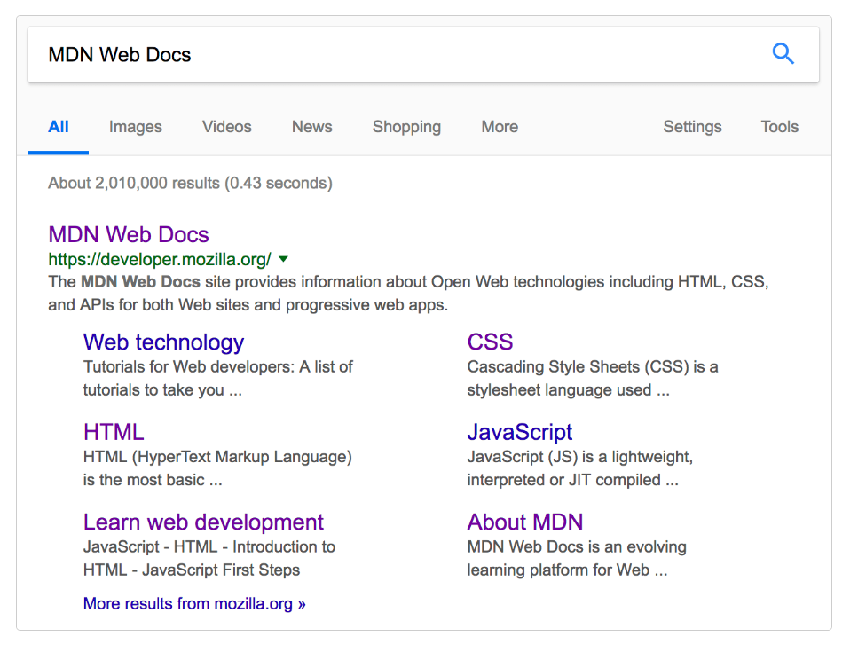

Nota: Muchas `<meta>` funciones ya no se utilizan. Por ejemplo, el <meta>elemento de palabra clave (html `<meta name="keywords" content="fill, in, your, keywords, here">`), que se supone que proporciona palabras clave para que los motores de búsqueda determinen la relevancia de esa página para diferentes términos de búsqueda, es ignorado por los motores de búsqueda, porque los spammers simplemente llenaban la lista de palabras clave con cientos de palabras clave, lo que sesgaba los resultados.
 
# Otros tipos de metadatos
A medida que navegue por la web, también encontrará otros tipos de metadatos. Muchas de las funciones que verá en los sitios web son creaciones exclusivas diseñadas para proporcionar a ciertos sitios (como los sitios de redes sociales) información específica que pueden usar.

Por ejemplo, [Open Graph Data](https://ogp.me/) es un protocolo de metadatos que inventó Facebook para proporcionar metadatos más completos a los sitios web. En el código fuente de MDN Web Docs, encontrará lo siguiente:

```html
<meta
  property="og:image"
  content="https://developer.mozilla.org/mdn-social-share.png" />
<meta
  property="og:description"
  content="The Mozilla Developer Network (MDN) provides
information about Open Web technologies including HTML, CSS, and APIs for both websites
and HTML Apps." />
<meta property="og:title" content="Mozilla Developer Network" />
```

Un efecto de esto es que cuando se vincula a MDN Web Docs en Facebook, el enlace aparece junto con una imagen y una descripción: una experiencia más rica para los usuarios.


# Cómo agregar iconos personalizados a su sitio
Para enriquecer aún más el diseño de su sitio, puede agregar referencias a íconos personalizados en sus metadatos, y estos se mostrarán en ciertos contextos. El más utilizado es el favicon (abreviatura de "ícono de favoritos", en referencia a su uso en las listas de "favoritos" o "marcadores" de los navegadores).

El humilde favicono existe desde hace muchos años. Es el primer icono de este tipo: un icono cuadrado de 16 píxeles que se utiliza en varios lugares. Es posible que veas (según el navegador) los faviconos en la pestaña del navegador que contiene cada página abierta y junto a las páginas marcadas en el panel de marcadores.

Se puede agregar un favicon a tu página de la siguiente manera:

 * Guardándolo en el mismo directorio que la página de índice del sitio, guardado en . icoformato (la mayoría también admite faviconos en formatos más comunes como .gifo .png)

 * Agregando la siguiente línea en tu bloque HTML `<head>` para hacer referencia a él:

```html
 <link rel="icon" href="favicon.ico" type="image/x-icon" />
 ```
A continuación se muestra un ejemplo de un favicono en un panel de marcadores:

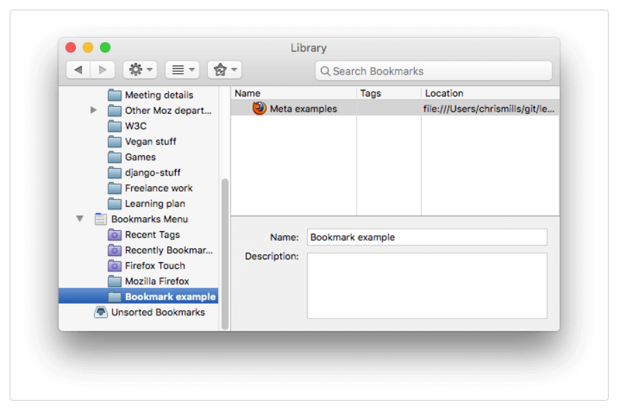

También es posible que necesites distintos iconos para distintos contextos. Por ejemplo, encontrarás esto en el código fuente de la página de inicio de MDN Web Docs:

```html
<link rel="icon" href="/favicon-48x48.[some hex hash].png" />
<link rel="apple-touch-icon" href="/apple-touch-icon.[some hex hash].png" />
```

Esta es una forma de hacer que el sitio muestre un ícono cuando se guarde en la pantalla de inicio de un dispositivo Apple. Es posible que incluso desee proporcionar íconos diferentes para diferentes dispositivos, para garantizar que el ícono se vea bien en todos los dispositivos. Por ejemplo:

```html
<!-- iPad Pro with high-resolution Retina display: -->
<link
  rel="apple-touch-icon"
  sizes="167x167"
  href="/apple-touch-icon-167x167.png" />
<!-- 3x resolution iPhone: -->
<link
  rel="apple-touch-icon"
  sizes="180x180"
  href="/apple-touch-icon-180x180.png" />
<!-- non-Retina iPad, iPad mini, etc.: -->
<link
  rel="apple-touch-icon"
  sizes="152x152"
  href="/apple-touch-icon-152x152.png" />
<!-- 2x resolution iPhone and other devices: -->
<link rel="apple-touch-icon" href="/apple-touch-icon-120x120.png" />
<!-- basic favicon -->
<link rel="icon" href="/favicon.ico" />
```

Los comentarios explican para qué se utiliza cada ícono: estos elementos cubren cosas como proporcionar un lindo ícono de alta resolución para usar cuando el sitio web se guarda en la pantalla de inicio de un iPad.

No te preocupes demasiado por implementar todos estos tipos de íconos ahora mismo: se trata de una función bastante avanzada y no se espera que tengas conocimientos sobre ella para avanzar en el curso. El objetivo principal de este artículo es informarte sobre qué son esas cosas, en caso de que te las encuentres mientras navegas por el código fuente de otros sitios web. Si quieres aprender más sobre todos estos valores y cómo elegirlos, lee la [<link>](https://developer.mozilla.org/en-US/docs/Web/HTML/Element/link) página de referencia del elemento.

# Aplicación de CSS y JavaScript a HTML
Casi todos los sitios web que utilizas en la actualidad emplean CSS para que tengan un aspecto atractivo y JavaScript para potenciar la funcionalidad interactiva, como reproductores de vídeo, mapas, juegos y más. Estos se aplican con mayor frecuencia a una página web mediante el `<link>` elemento y el `<script>` elemento, respectivamente.

El `<link>` elemento siempre debe ir dentro del encabezado del documento. Esto requiere dos atributos, rel="stylesheet", que indica que es la hoja de estilo del documento, y href, que contiene la ruta al archivo de la hoja de estilo:

```html
<link rel="stylesheet" href="my-css-file.css" />
```

El `<script>` elemento también debe ir en el encabezado y debe incluir un srcatributo que contenga la ruta al JavaScript que desea cargar, y defer, que básicamente le indica al navegador que cargue el JavaScript después de que la página haya terminado de analizar el HTML. Esto es útil ya que garantiza que todo el HTML esté cargado antes de que se ejecute el JavaScript, de modo que no obtenga errores resultantes de que JavaScript intente acceder a un elemento HTML que aún no existe en la página. En realidad, hay varias formas de manejar la carga de JavaScript en su página, pero esta es la más confiable para usar en los navegadores modernos (para otros, lea Estrategias de carga de scripts ).

```html
<script src="my-js-file.js" defer></script>
```

# Establecer el idioma principal del documento
Por último, vale la pena mencionar que puedes (y realmente deberías) configurar el idioma de tu página. Esto se puede hacer agregando el atributo lang a la etiqueta HTML de apertura (como se ve en el meta-example.html y se muestra a continuación).
```html
<html lang="en-US">
  …
</html>
```

Esto resulta útil de muchas maneras. Los motores de búsqueda indexarán su documento HTML de manera más eficaz si se configura su idioma lo que le permitirá aparecer correctamente en los resultados específicos del idioma.

También puedes configurar subsecciones de tu documento para que se reconozcan en distintos idiomas. Por ejemplo, podríamos configurar nuestra sección en japonés para que se reconozca como japonés, de la siguiente manera:
```html
<p>Japanese example: <span lang="ja">ご飯が熱い。</span>.</p>
```

Estos códigos están definidos por la norma [ISO 639-1](https://en.wikipedia.org/wiki/ISO_639-1) . Puedes encontrar más información sobre ellos en Etiquetas de idioma en [HTML y XML](https://www.w3.org/International/articles/language-tags/) .


# Encabezados y párrafos en HTML
Una de las principales funciones del HTML es dar estructura al texto para que un navegador pueda mostrar un documento HTML de la forma en que lo desea su desarrollador.

Encabezados y párrafos
La mayoría de los textos estructurados se componen de títulos y párrafos, ya sea que esté leyendo una historia, un periódico, un libro de texto universitario, una revista, etc.


El contenido estructurado hace que la experiencia de lectura sea más fácil y agradable.

En HTML, cada párrafo debe estar envuelto en un `<p>` elemento, de la siguiente manera:
```html
<p>I am a paragraph, oh yes I am.</p>
```

Cada encabezado debe estar envuelto en un elemento de encabezado:
```html
<h1>I am the title of the story.</h1>
```
Hay seis elementos de encabezado: h1 , h2 , h3 , h4 , h5 y h6 . Cada elemento representa un nivel diferente de contenido en el documento: `<h1>` representa el encabezado principal, `<h2>` representa subtítulos, `<h3>` representa subsubtítulos, etc.

# Implementación de la jerarquía estructural
Por ejemplo, en esta historia, el `<h1>` elemento representa el título de la historia, los `<h2>` elementos representan el título de cada capítulo y los `<h3>` elementos representan subsecciones de cada capítulo:

```html
<h1>The Crushing Bore</h1>

<p>By Chris Mills</p>

<h2>Chapter 1: The dark night</h2>

<p>
  It was a dark night. Somewhere, an owl hooted. The rain lashed down on the…
</p>

<h2>Chapter 2: The eternal silence</h2>

<p>Our protagonist could not so much as a whisper out of the shadowy figure…</p>

<h3>The specter speaks</h3>

<p>
  Several more hours had passed, when all of a sudden the specter sat bolt
  upright and exclaimed, "Please have mercy on my soul!"
</p>
```

Depende de usted qué representan los elementos involucrados, siempre que la jerarquía tenga sentido. Solo debe tener en cuenta algunas prácticas recomendadas al crear dichas estructuras:

* Lo mejor es utilizar uno solo `<h1>` por página: este es el encabezado de nivel superior y todos los demás se ubican debajo de este en la jerarquía.

* Asegúrate de utilizar los títulos en el orden correcto en la jerarquía. No utilices `<h3>` elementos para representar subtítulos seguidos de `<h2>` otros elementos para representar subtítulos secundarios, ya que eso no tiene sentido y dará lugar a resultados extraños.

* De los seis niveles de encabezado disponibles, debe intentar utilizar no más de tres por página, a menos que considere que es necesario. Los documentos con muchos niveles (por ejemplo, una jerarquía de encabezados profunda) se vuelven difíciles de manejar y de navegar. En tales ocasiones, es recomendable distribuir el contenido en varias páginas, si es posible.


# ¿Por qué necesitamos la semántica?
La semántica es un elemento que nos rodea en todas partes: nos basamos en la experiencia previa para saber cuál es la función de un objeto cotidiano; cuando vemos algo, sabemos cuál será su función. Así, por ejemplo, esperamos que un semáforo en rojo signifique "parar" y uno en verde, "avanzar". Las cosas pueden complicarse muy rápidamente si se aplica la semántica incorrecta. (¿Hay algún país que utilice el rojo para significar "avanzar"? Esperamos que no.)

De manera similar, debemos asegurarnos de que estamos utilizando los elementos correctos, dándole a nuestro contenido el significado, la función o la apariencia correcta. En este contexto, el elemento h1 también es un elemento semántico, que le otorga al texto que lo rodea la función (o significado) de "un encabezado de nivel superior en su página".

```html
<h1>This is a top level heading</h1>
```

De forma predeterminada, el navegador le dará un tamaño de fuente grande para que parezca un encabezado (aunque podría darle el estilo que quisiera usando CSS). Más importante aún, su valor semántico se usará de múltiples maneras, por ejemplo, por los motores de búsqueda y los lectores de pantalla.

Por otra parte, puedes hacer que cualquier elemento parezca un encabezado de nivel superior. Considera lo siguiente:

```html
<span style="font-size: 32px; margin: 21px 0; display: block;">
  Is this a top level heading?
</span>
```

Este es un `<span>` elemento. No tiene semántica. Lo usas para envolver contenido cuando quieres aplicarle CSS (o hacerle algo con JavaScript) sin darle ningún significado adicional. (Descubrirás más sobre esto más adelante en el curso). Le hemos aplicado algo de CSS para que parezca un encabezado de nivel superior, pero como no tiene valor semántico, no obtendrá ninguno de los beneficios adicionales descritos anteriormente. Es una buena idea usar el elemento HTML relevante para el trabajo.


# Énfasis e importancia
El artículo anterior analizó por qué la semántica es importante en HTML y se centró en los encabezados y párrafos. Este artículo continúa con el tema de la semántica y analiza los elementos HTML que aplican énfasis e importancia al texto (en paralelo al texto en cursiva y negrita en los medios impresos).

# ¿Qué son el énfasis y la importancia?
En el lenguaje humano, a menudo enfatizamos ciertas palabras para alterar el significado de una oración y, a menudo, queremos marcar ciertas palabras como importantes o diferentes de alguna manera. HTML proporciona varios elementos semánticos que nos permiten marcar contenido textual con tales efectos y, en esta sección, veremos algunos de los más comunes.

# Énfasis
Cuando queremos añadir énfasis en el lenguaje hablado, acentuamos ciertas palabras, alterando sutilmente el significado de lo que decimos. De manera similar, en el lenguaje escrito tendemos a acentuar las palabras poniéndolas en cursiva. Por ejemplo, las siguientes dos oraciones tienen significados diferentes.

> Me alegro de que no llegaras tarde.
> Me alegro de que no llegaras tarde .

La primera oración suena genuinamente aliviada de que la persona no haya llegado tarde. En cambio, la segunda, con las palabras "me alegro" y "llegó tarde" en cursiva, suena sarcástica o pasivo-agresiva, expresando molestia por el hecho de que la persona haya llegado un poco tarde.

En HTML, utilizamos el `<em>` elemento (énfasis) para marcar estos casos. Además de hacer que el documento sea más interesante de leer, los lectores de pantalla los reconocen y pueden configurarse para que los lea en un tono de voz diferente. Los navegadores lo escriben en cursiva de forma predeterminada, pero no deberías usar esta etiqueta únicamente para obtener el estilo en cursiva. Para ello, utilizarías un `<span>` elemento y algo de CSS, o quizás un `<i>` elemento (ver a continuación).

```html
<p>I am <em>glad</em> you weren't <em>late</em>.</p>
```

# Fuerte importancia
Para enfatizar palabras importantes, solemos ponerlas en relieve en el lenguaje hablado y en negrita en el lenguaje escrito. Por ejemplo:

> Este líquido es altamente tóxico .
> Cuento contigo, no llegues tarde!

En HTML, utilizamos el `<strong>` elemento (importancia fuerte) para marcar dichas instancias. Además de hacer que el documento sea más útil, los lectores de pantalla las reconocen y pueden configurarse para que las digan en un tono de voz diferente. Los navegadores le dan estilo a este texto en negrita de forma predeterminada, pero no debería utilizar esta etiqueta únicamente para obtener un estilo en negrita. Para ello, debe utilizar un `<span>` elemento y algo de CSS, o quizás un `<b>` elemento (consulte a continuación).

```html
<p>This liquid is <strong>highly toxic</strong>.</p>

<p>I am counting on you. <strong>Do not</strong> be late!</p>
```

Puedes anidar fuerte y énfasis uno dentro del otro si lo deseas:
```html
<p>This liquid is <strong>highly toxic</strong> — if you drink it, <strong>you may <em>die</em></strong>.</p>
```


# Cursiva, negrita, subrayado…
Los elementos que hemos analizado hasta ahora tienen una semántica asociada muy clara. La situación con `<b>`, `<i>`, y `<u>` es algo más complicada. Surgieron para que la gente pudiera escribir texto en negrita, cursiva o subrayado en una época en la que CSS todavía no se admitía o no se admitía en absoluto. Elementos como este, que solo afectan a la presentación y no a la semántica, se conocen como elementos de presentación y ya no deberían utilizarse porque, como hemos visto antes, la semántica es muy importante para la accesibilidad, el SEO, etc.

HTML5 redefinido `<b>`, `<i>`y `<u>` con nuevos roles semánticos, algo confusos.

Esta es la mejor regla que puedes recordar: solo es apropiado usar `<b>`, `<i>`, o `<u>` para transmitir un significado que tradicionalmente se transmite con negrita, cursiva o subrayado cuando no hay un elemento más adecuado (y generalmente lo hay). Considera si `<strong>`, `<em>`, `<mark>`o `<span>`podrían ser más apropiados.

Mantenga siempre una actitud de accesibilidad. El concepto de cursiva no resulta muy útil para quienes utilizan lectores de pantalla o un sistema de escritura distinto del alfabeto latino.

* `<i>`se utiliza para transmitir un significado que tradicionalmente se transmite en cursiva: palabras extranjeras, designaciones taxonómicas, términos técnicos, un pensamiento…

* `<b>` Se utiliza para transmitir un significado que tradicionalmente se transmite en negrita: palabras clave, nombres de productos, frases iniciales…

* `<u>` se utiliza para transmitir un significado que tradicionalmente se transmite mediante el subrayado: nombre propio, falta de ortografía…


# Nota: 
> Las personas asocian fuertemente el subrayado con los hipervínculos. Por lo tanto, en > la Web, es mejor subrayar únicamente los vínculos. Utilice el `<u>` elemento cuando   > sea semánticamente apropiado, pero considere usar CSS para cambiar el subrayado
> predeterminado a algo más apropiado en la Web.

# Listas
Ahora, dirijamos nuestra atención a las listas. Las listas están en todas partes en la vida: desde la lista de compras hasta la lista de instrucciones que sigues inconscientemente para llegar a tu casa todos los días, pasando por las listas de instrucciones que sigues en estos tutoriales. Puede que no te sorprenda que HTML tenga un conjunto conveniente de elementos que nos permite definir diferentes tipos de listas. En la web, tenemos tres tipos de listas: desordenadas, ordenadas y descriptivas.

# Listas desordenadas
 Las listas desordenadas se utilizan para marcar listas de artículos en las que el orden de los mismos no importa. Tomemos como ejemplo una lista de compras:

> milk
> eggs
> bread
> hummus

Toda lista desordenada comienza con un `<ul>` elemento que envuelve todos los elementos de la lista:

```html
<ul>
  milk
  eggs
  bread
  hummus
</ul>
```

El último paso es envolver cada elemento de la lista en un `<li>` elemento (elemento de la lista):
```html
<ul>
  <li>milk</li>
  <li>eggs</li>
  <li>bread</li>
  <li>hummus</li>
</ul>
```

# Ordenado
 Las listas ordenadas son listas en las que el orden de los elementos sí importa

 La estructura de marcado es la misma que para las listas desordenadas, excepto que debe envolver los elementos de la lista en un `<ol>` elemento, en lugar de `<ul>`:

```html
 <ol>
  <li>Drive to the end of the road</li>
  <li>Turn right</li>
  <li>Go straight across the first two roundabouts</li>
  <li>Turn left at the third roundabout</li>
  <li>The school is on your right, 300 meters up the road</li>
</ol>
```

# Listas de anidación
Está perfectamente bien anidar una lista dentro de otra. Es posible que quieras tener algunas viñetas secundarias debajo de una viñeta de nivel superior.

```html
<ol>
  <li>Remove the skin from the garlic, and chop coarsely.</li>
  <li>Remove all the seeds and stalk from the pepper, and chop coarsely.</li>
  <li>Add all the ingredients into a food processor.</li>
  <li>
    Process all the ingredients into a paste.
    <ul>
      <li>
        If you want a coarse "chunky" hummus, process it for a short time.
      </li>
      <li>If you want a smooth hummus, process it for a longer time.</li>
    </ul>
  </li>
</ol>
```

# Listas de descripciones
El objetivo de las listas de descripción es marcar un conjunto de elementos y sus descripciones asociadas, como términos y definiciones, o preguntas y respuestas.

Las listas de descripción utilizan un contenedor diferente al de los otros tipos de listas `<dl>`; además, cada término está envuelto en un `<dt>` elemento (término de descripción), y cada descripción está envuelta en un `<dd>` elemento (definición de descripción).`

#### Ejemplo de lista de descripciones

```html
<dl>
  <dt>soliloquy</dt>
  <dd>
    In drama, where a character speaks to themselves, representing their inner
    thoughts or feelings and in the process relaying them to the audience (but
    not to other characters.)
  </dd>
  <dt>monologue</dt>
  <dd>
    In drama, where a character speaks their thoughts out loud to share them
    with the audience and any other characters present.
  </dd>
  <dt>aside</dt>
  <dd>
    In drama, where a character shares a comment only with the audience for
    humorous or dramatic effect. This is usually a feeling, thought, or piece of
    additional background information.
  </dd>
</dl>
```

Los estilos predeterminados del navegador mostrarán listas de descripciones con las descripciones algo sangradas respecto de los términos.

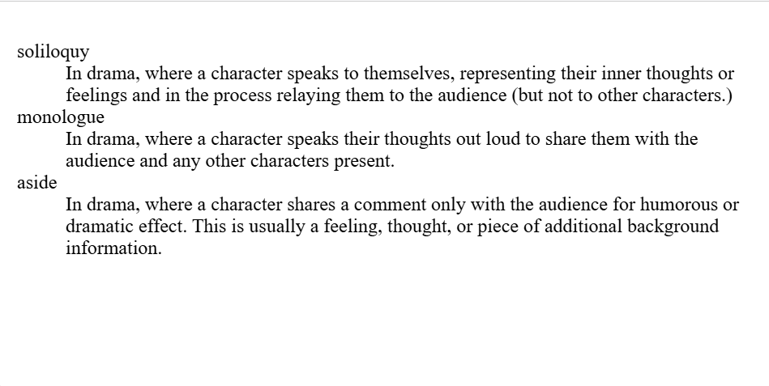

# Varias descripciones para un término
Tenga en cuenta que se permite tener un solo término con múltiples descripciones, por ejemplo:

```html
<dl>
  <dt>aside</dt>
  <dd>
    In drama, where a character shares a comment only with the audience for
    humorous or dramatic effect. This is usually a feeling, thought, or piece of
    additional background information.
  </dd>
  <dd>
    In writing, a section of content that is related to the current topic, but
    doesn't fit directly into the main flow of content so is presented nearby
    (often in a box off to the side.)
  </dd>
</dl>
```

# Estructuración de documentos
Además de definir partes individuales de su página (como "un párrafo" o "una imagen"), HTML también cuenta con una serie de elementos a nivel de bloque que se utilizan para definir áreas de su sitio web (como "el encabezado", "el menú de navegación", "la columna de contenido principal"). Este artículo analiza cómo planificar una estructura básica de sitio web y escribir el HTML para representar esta estructura.


# Secciones básicas de un documento
Las páginas web pueden verse y se verán bastante diferentes entre sí, pero todas tienden a compartir componentes estándar similares, a menos que la página muestre un video o un juego en pantalla completa, sea parte de algún tipo de proyecto de arte o simplemente esté mal estructurada:

encabezamiento:
> Generalmente, se trata de una franja grande en la parte superior con un encabezado
> grande, un logotipo y, tal vez, un eslogan.

barra de navegación:
> Enlaces a las secciones principales del sitio; generalmente representados por botones > de menú, enlaces o pestañas.

Contenido principal:
> Una gran área en el centro que contiene la mayor parte del contenido exclusivo de una > página web determinada, por ejemplo, el video que desea ver, la historia principal que > está leyendo, el mapa que desea ver, los titulares de las noticias, etc.

barra lateral:
> Alguna información periférica, enlaces, citas, anuncios, etc. 

pie de página:
> Una franja en la parte inferior de la página que generalmente contiene letra pequeña, > avisos de derechos de autor o información de contacto.

Un "sitio web típico" podría estructurarse así:

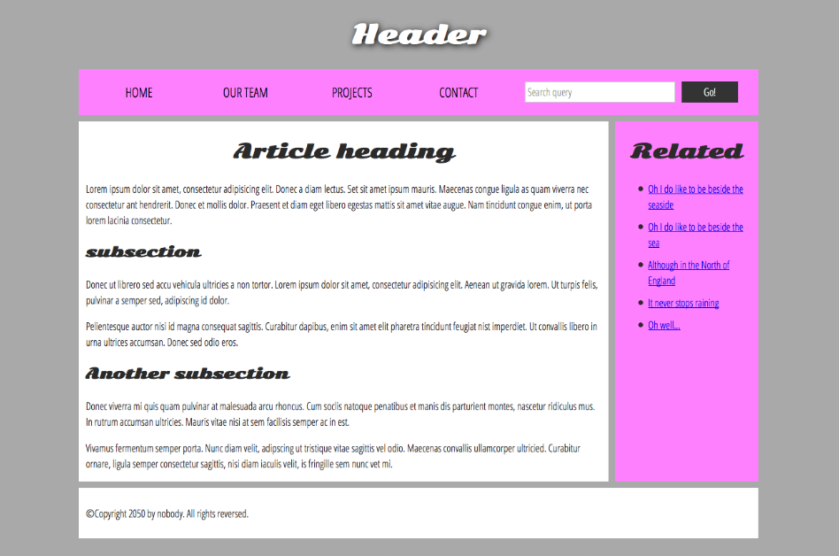

## Nota:
> La imagen anterior ilustra las secciones principales de un documento, que se pueden 
> definir con HTML. Sin embargo, la apariencia de la página que se muestra aquí 
> (incluido el diseño, los colores y las fuentes) se logra aplicando CSS al HTML.

# HTML para estructurar contenidos
El ejemplo que se muestra arriba no es bonito, pero es perfecto para ilustrar un ejemplo típico de diseño de sitio web. Algunos sitios web tienen más columnas, otros son mucho más complejos, pero ya se entiende la idea. Con el CSS correcto, se pueden usar prácticamente todos los elementos para envolver las diferentes secciones y lograr que se vean como se desea, pero como se mencionó anteriormente, debemos respetar la semántica y usar el elemento correcto para la tarea correcta .

Esto se debe a que los elementos visuales no cuentan toda la historia. Usamos el color y el tamaño de fuente para atraer la atención de los usuarios con visión hacia las partes más útiles del contenido, como el menú de navegación y los enlaces relacionados, pero ¿qué pasa con las personas con discapacidad visual, por ejemplo, a quienes podrían no resultarles muy útiles conceptos como "rosa" y "fuente grande"?

# Nota: 
> Aproximadamente el 8% de los hombres y el 0,5% de las mujeres son daltónicos; o, dicho de otro modo, 
> aproximadamente 1 de cada 12 hombres y 1 de cada 200 mujeres. Las personas ciegas y con discapacidad visual 
> representan aproximadamente el 4-5% de la población mundial (en 2015 había 940 millones de personas con algún > grado de pérdida de visión , mientras que la población total era de alrededor de 7.500 millones ).

En el código HTML, puedes marcar secciones de contenido en función de su funcionalidad : puedes usar elementos que representen las secciones de contenido descritas anteriormente de manera inequívoca, y las tecnologías de asistencia, como los lectores de pantalla, pueden reconocer esos elementos y ayudar con tareas como "encontrar la navegación principal" o "encontrar el contenido principal". Como mencionamos anteriormente en el curso, existen varias consecuencias de no usar la estructura y la semántica de elementos correctas para el trabajo correcto .

Para implementar dicho marcado semántico, HTML proporciona etiquetas dedicadas que puedes usar para representar dichas secciones, por ejemplo:

* encabezado: ` <header>` .
* barra de navegación: `<nav>` .
* contenido principal: `<main>` , con varias subsecciones de contenido representadas por elementos `<article>`, `<section>`, y .`<div>`
* barra lateral: `<aside>` ; a menudo se coloca dentro de `<main>`.
* pie de página: ` <footer>` .

# Elementos de diseño HTML con más detalle
Es bueno comprender en detalle el significado general de todos los elementos de sección HTML; esto es algo en lo que trabajarás gradualmente a medida que adquieras más experiencia con el desarrollo web. Puedes encontrar muchos detalles leyendo nuestra [referencia de elementos HTML](https://developer.mozilla.org/en-US/docs/Web/HTML/Element) . Por ahora, estas son las definiciones principales que debes intentar comprender:

* `<main>`es para contenido exclusivo de esta página. Úselo `<main>`solo una vez por página y colóquelo directamente dentro de `<body>`. Lo ideal es que no esté anidado dentro de otros elementos.

* `<article>`encierra un bloque de contenido relacionado que tiene sentido por sí solo sin el resto de la página (por ejemplo, una sola publicación de blog).

* `<section>`es similar a `<article>`, pero sirve más para agrupar una sola parte de la página que constituye una única pieza de funcionalidad (por ejemplo, un minimapa o un conjunto de títulos y resúmenes de artículos) o un tema. Se considera una buena práctica comenzar cada sección con un encabezado ; también tenga en cuenta que puede dividir `<article>`s en diferentes `<section>`s, o `<section>`s en diferentes `<article>`s, según el contexto.

* `<aside>`contiene contenido que no está directamente relacionado con el contenido principal, pero que puede proporcionar información adicional relacionada indirectamente con él (entradas de glosario, biografía del autor, enlaces relacionados, etc.).

* `<header>`representa un grupo de contenido introductorio. Si es un elemento secundario de `<body>`, define el encabezado global de una página web, pero si es un elemento secundario de `<article>`, `<section>`define un encabezado específico para esa sección (intente no confundir esto con títulos y encabezados ).

* `<nav>`Contiene la funcionalidad de navegación principal de la página. Los enlaces secundarios, etc., no se incluirían en la navegación.

* `<footer>`Representa un grupo de contenido final para una página.

# Envoltorios no semánticos
A veces te encontrarás con una situación en la que no puedes encontrar un elemento semántico ideal para agrupar algunos elementos o envolver algún contenido. A veces, es posible que desees simplemente agrupar un conjunto de elementos para que todos ellos actúen como una sola entidad con algo de CSS o JavaScript . Para casos como estos, HTML proporciona los elementos `<div>`y `<span>`. Debes usarlos preferiblemente con un classatributo adecuado, para proporcionar algún tipo de etiqueta para ellos de modo que se puedan identificar fácilmente.

`<span>`es un elemento no semántico en línea que solo deberías usar si no se te ocurre un mejor elemento de texto semántico para envolver tu contenido o si no quieres agregar ningún significado específico. Por ejemplo:

```html
<p>
  The King walked drunkenly back to his room at 01:00, the beer doing nothing to
  aid him as he staggered through the door.
  <span class="editor-note">
    [Editor's note: At this point in the play, the lights should be down low].
  </span>
</p>
```

En este caso, la nota del editor se supone que solo debe proporcionar una orientación adicional al director de la obra; no se supone que tenga un significado semántico adicional. 

`<div>`es un elemento no semántico a nivel de bloque que solo deberías usar si no se te ocurre un elemento de bloque semántico mejor para usar o si no quieres agregar ningún significado específico. Por ejemplo, imagina un widget de carrito de compras que podrías elegir abrir en cualquier momento durante tu tiempo en un sitio de comercio electrónico:

```html
<div class="shopping-cart">
  <h2>Shopping cart</h2>
  <ul>
    <li>
      <p>
        <a href=""><strong>Silver earrings</strong></a>: $99.95.
      </p>
      
    </li>
    <li>…</li>
  </ul>
  <p>Total cost: $237.89</p>
</div>
```

# ⚠️ Advertencia: 
> Los divs son tan fáciles de usar que es fácil usarlos demasiado. Como no tienen ningún valor semántico, solo > abarrotan el código HTML. Tenga cuidado de usarlos solo cuando no haya una mejor solución semántica e intente > reducir su uso al mínimo, de lo contrario tendrá dificultades para actualizar y mantener sus documentos.


# Saltos de línea y reglas horizontales
Dos elementos que utilizarás ocasionalmente y que querrás conocer son `<br>`y `<hr>`.

# ` <br>`: el elemento de salto de línea
`<br>`Crea un salto de línea en un párrafo; es la única forma de forzar una estructura rígida en una situación en la que se desea una serie de líneas cortas fijas, como en una dirección postal o en un poema. Por ejemplo:

`<hr>`: el elemento de ruptura temática
`<hr>`Los elementos crean una línea horizontal en el documento que denota un cambio temático en el texto (como un cambio de tema o escena). Visualmente, parece una línea horizontal. A modo de ejemplo:

```html
<p>
  Ron was backed into a corner by the marauding netherbeasts. Scared, but
  determined to protect his friends, he raised his wand and prepared to do
  battle, hoping that his distress call had made it through.
</p>
<hr />
<p>
  Meanwhile, Harry was sitting at home, staring at his royalty statement and
  pondering when the next spin off series would come out, when an enchanted
  distress letter flew through his window and landed in his lap. He read it
  hazily and sighed; "better get back to work then", he mused.
</p>
```

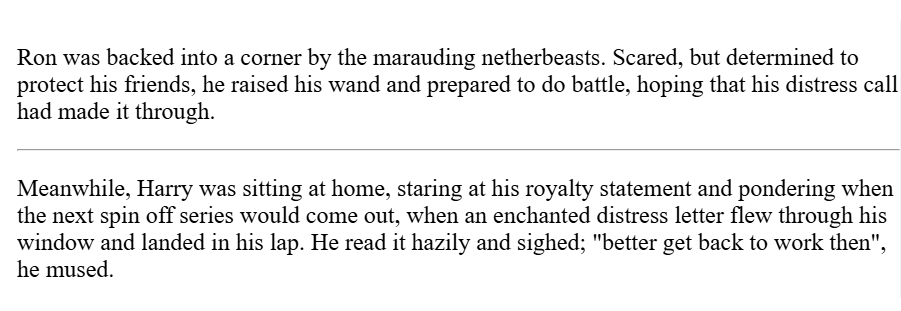

# Funciones de texto avanzadas
Existen muchos otros elementos en HTML para definir la semántica del texto, que no abordamos en el artículo Énfasis e importancia . Los elementos descritos en este artículo son menos conocidos, pero aun así es útil conocerlos (y esta no es una lista completa de ninguna manera). Aquí aprenderá sobre el marcado de citas, listas de descripciones, código informático y otros textos relacionados, subíndices y superíndices, información de contacto y más.

# Citas
> HTML contiene funciones disponibles para marcar citas; el elemento que utilice dependerá > de si está marcando un bloque o una cita en línea.

# Citas en bloque
Si una sección de contenido a nivel de bloque (ya sea un párrafo, varios párrafos, una lista, etc.) se cita de otro lugar, debe incluirla dentro de un ` <blockquote>`elemento para indicarlo e incluir una URL que apunte a la fuente de la cita dentro de un citeatributo.

```html
<p>Here is a blockquote:</p>
<blockquote
  cite="https://developer.mozilla.org/en-US/docs/Web/HTML/Element/blockquote">
  <p>
    The <strong>HTML <code>&lt;blockquote&gt;</code> Element</strong> (or
    <em>HTML Block Quotation Element</em>) indicates that the enclosed text is
    an extended quotation.
  </p>
</blockquote>
```

El estilo predeterminado del navegador lo representará como un párrafo sangrado, como indicador de que es una cita; el párrafo encima de la cita está allí para demostrarlo.

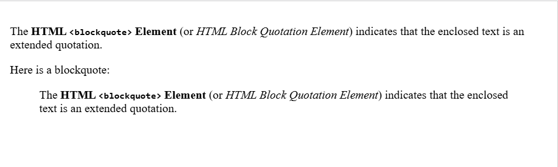

# Citas en línea
Las citas en línea funcionan exactamente de la misma manera, excepto que utilizan el `<q>`elemento . Por ejemplo, el siguiente fragmento de marcado contiene una cita de la `<q>`página de MDN:

```html
<p>
  The quote element — <code>&lt;q&gt;</code> — is
  <q cite="https://developer.mozilla.org/en-US/docs/Web/HTML/Element/q">
    intended for short quotations that don't require paragraph breaks.
  </q>
</p>
```

# Abreviaturas
Otro elemento bastante común que encontrará al navegar por la Web es `<abbr>`— se utiliza para envolver una abreviatura o un acrónimo. Cuando incluya alguno de ellos, proporcione una expansión completa del término en texto sin formato en el primer uso, junto con el `<abbr>`para marcar la abreviatura. Esto proporciona una pista a los agentes de usuario sobre cómo anunciar/mostrar el contenido al tiempo que informa a todos los usuarios lo que significa la abreviatura.

Si proporcionar la expansión además de la abreviatura tiene poco sentido, y la abreviatura o acrónimo es un término bastante abreviado, proporcione la expansión completa del término como valor del `<title>` atributo:

```html
<p>
  We use <abbr>HTML</abbr>, Hypertext Markup Language, to structure our web
  documents.
</p>

<p>
  I think <abbr title="Reverend">Rev.</abbr> Green did it in the kitchen with
  the chainsaw.
</p>
```

Estos se verán así:

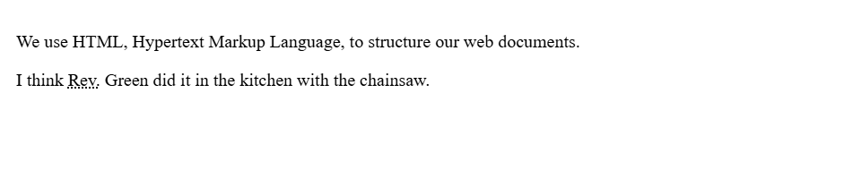

# Nota: 
> Las versiones anteriores de HTML también incluían soporte para el `<acronym>`elemento, 
> pero se eliminó de la especificación HTML a favor de su uso`<abbr>`para representar tanto > abreviaturas como acrónimos. `<acronym>`no debe utilizarse.


# Marcar datos de contacto
HTML tiene un elemento para marcar los datos de contacto: `<address>`. Este envuelve los datos de contacto, por ejemplo:`

```html
<address>Chris Mills, Manchester, The Grim North, UK</address>
```

También podría incluir un marcado más complejo y otras formas de información de contacto, por ejemplo:

```html
<address>
  <p>
    Chris Mills<br />
    Manchester<br />
    The Grim North<br />
    UK
  </p>

  <ul>
    <li>Tel: 01234 567 890</li>
    <li>Email: me@grim-north.co.uk</li>
  </ul>
</address>
```

# Nota:
> El `<address>`elemento solo debe utilizarse para proporcionar información de contacto para > el documento contenido en el elemento `<article>`or más cercano `<body>`. Sería correcto 
> utilizarlo en el pie de página de un sitio para incluir la información de contacto de 
> todo el sitio, o dentro de un artículo para los datos de contacto del autor, pero no 
> para marcar una lista de direcciones no relacionadas con el contenido de esa página.

# Superíndice y subíndice
Ocasionalmente, necesitarás usar superíndices y subíndices al marcar elementos como fechas, fórmulas químicas y ecuaciones matemáticas para que tengan el significado correcto. Los elementos `<sup>` y `<sub>` se encargan de esta tarea. Por ejemplo:

```html
<p>My birthday is on the 25<sup>th</sup> of May 2001.</p>
<p>
  Caffeine's chemical formula is
  C<sub>8</sub>H<sub>10</sub>N<sub>4</sub>O<sub>2</sub>.
</p>
<p>If x<sup>2</sup> is 9, x must equal 3 or -3.</p>
```

La salida de este código se ve así:

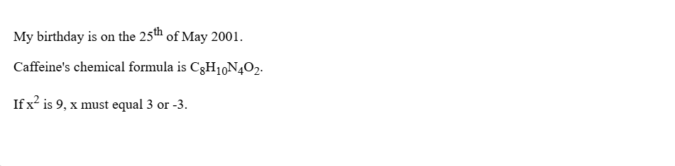

# Representando código de computadora
Hay varios elementos disponibles para marcar código informático utilizando HTML:

* `<code>`:Para marcar fragmentos genéricos de código informático.

* `<pre>`:Para conservar los espacios en blanco (generalmente bloques de código): si utiliza sangría o exceso de espacios en blanco dentro del texto, los navegadores lo ignorarán y no lo verá en la página renderizada. `<pre></pre>`Sin embargo, si envuelve el texto entre etiquetas, los espacios en blanco se renderizarán de forma idéntica a como los ve en su editor de texto.

* `<var>`:Para marcar específicamente nombres de variables.

* `<kbd>`:Para marcar las entradas del teclado (y otros tipos de entradas) ingresadas en la computadora.

* `<samp>`:Para marcar la salida de un programa de computadora.

Veamos ejemplos de estos elementos y cómo se utilizan para representar código informático. 

```html
<pre><code>const para = document.querySelector('p');

para.onclick = function() {
  alert('Owww, stop poking me!');
}</code></pre>

<p>
  You shouldn't use presentational elements like <code>&lt;font&gt;</code> and
  <code>&lt;center&gt;</code>.
</p>

<p>
  In the above JavaScript example, <var>para</var> represents a paragraph
  element.
</p>

<p>Select all the text with <kbd>Ctrl</kbd>/<kbd>Cmd</kbd> + <kbd>A</kbd>.</p>

<pre>$ <kbd>ping mozilla.org</kbd>
<samp>PING mozilla.org (63.245.215.20): 56 data bytes
64 bytes from 63.245.215.20: icmp_seq=0 ttl=40 time=158.233 ms</samp></pre>
```

El código anterior se verá así:

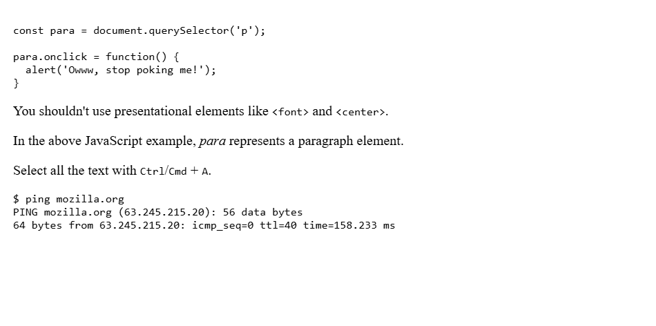

# Marcar horas y fechas
HTML también proporciona el `<time>` elemento para marcar horas y fechas en un formato legible por máquina. Por ejemplo:

```html
<time datetime="2016-01-20">20 January 2016</time>
```

¿Por qué es útil esto? Bueno, hay muchas formas diferentes en que los humanos anotamos fechas. La fecha anterior podría escribirse de la siguiente manera:

* 20 de enero de 2016
* 20 de enero de 2016
* 20 de enero de 2016
* 20/01/16
* 20/01/16
* El día 20 del mes que viene
* 20 de enero de 2016
* 20 de enero de 2016
* Etcétera

Pero las computadoras no pueden reconocer fácilmente estas distintas formas: ¿qué sucedería si quisieras capturar automáticamente las fechas de todos los eventos de una página e insertarlas en un calendario? El `<time>` elemento te permite adjuntar una fecha y hora inequívocas y legibles por computadora para este propósito.

```html
<!-- Standard simple date -->
<time datetime="2016-01-20">20 January 2016</time>
<!-- Just year and month -->
<time datetime="2016-01">January 2016</time>
<!-- Just month and day -->
<time datetime="01-20">20 January</time>
<!-- Just time, hours and minutes -->
<time datetime="19:30">19:30</time>
<!-- You can do seconds and milliseconds too! -->
<time datetime="19:30:01.856">19:30:01.856</time>
<!-- Date and time -->
<time datetime="2016-01-20T19:30">7.30pm, 20 January 2016</time>
<!-- Date and time with timezone offset -->
<time datetime="2016-01-20T19:30+01:00">
  7.30pm, 20 January 2016 is 8.30pm in France
</time>
<!-- Calling out a specific week number -->
<time datetime="2016-W04">The fourth week of 2016</time>
```

# Creando enlaces
Los enlaces (también conocidos como hipervínculos) son muy importantes: son lo que hace que la Web sea una Web . 

# ¿Qué es un hipervínculo?
Los hipervínculos son una de las innovaciones más interesantes que ofrece la Web. Han sido una característica de la Web desde el principio y son lo que hace que la Web sea una Web. Los hipervínculos nos permiten vincular documentos a otros documentos o recursos, vincular a partes específicas de documentos o hacer que las aplicaciones estén disponibles en una dirección web. Casi cualquier contenido web se puede convertir en un enlace de modo que, al hacer clic en él o activarlo de alguna otra forma, el navegador web vaya a otra dirección web ( URL ).

# Nota:
> una URL puede apuntar a archivos HTML, archivos de texto, imágenes, documentos de texto, > archivos de video y audio, o cualquier otra cosa que se encuentre en la Web.


# Anatomía de un enlace
Un enlace básico se crea envolviendo el texto u otro contenido dentro de un `<a>` elemento y utilizando el `href` atributo, también conocido como Referencia de hipertexto o target , que contiene la dirección web.

```html
<p>
  I'm creating a link to
  <a href="https://www.mozilla.org/en-US/">the Mozilla homepage</a>.
</p>
```

Esto nos da el siguiente resultado:

Estoy creando un enlace a [la página de inicio de Mozilla](https://www.mozilla.org/en-US/) .

# Enlaces a nivel de bloque
Como se mencionó anteriormente, casi cualquier contenido se puede convertir en un enlace, incluso los elementos a nivel de bloque . Si desea convertir un elemento de encabezado en un enlace, envuélvalo en un `<a>` elemento de ancla ( ) como se muestra en el siguiente fragmento de código:


```html
<a href="https://developer.mozilla.org/en-US/">
  <h1>MDN Web Docs</h1>
</a>
<p>
  Documenting web technologies, including CSS, HTML, and JavaScript, since 2005.
</p>
```

Esto convierte el encabezado en un enlace:


> [MDN Web Docs](https://developer.mozilla.org/en-US/docs/Learn_web_development/Core/Structuring_content/Creating_links)
> Documenting web technologies, including CSS, HTML, and JavaScript, since 2005.


# Una breve introducción a las URL y las rutas
Para comprender completamente los destinos de los enlaces, es necesario comprender las URL y las rutas de archivo. Esta sección le brinda la información que necesita para lograrlo.

Una URL, o localizador uniforme de recursos, es una cadena de texto que define dónde se encuentra algo en la Web. Por ejemplo, la página de inicio en inglés de Mozilla se encuentra en https://www.mozilla.org/en-US/.

Las URL utilizan rutas para buscar archivos. Las rutas especifican dónde se encuentra el archivo que le interesa en el sistema de archivos. Veamos un ejemplo de una estructura de directorio; consulte la creating-hyperlinksestructura de directorio que se muestra a continuación:

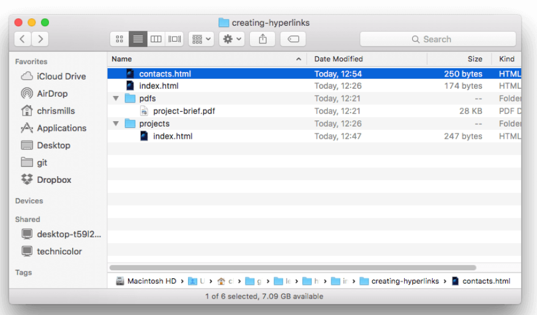

* Volver a subir a los directorios principales : si quisiera incluir un hipervínculo dentro projects/index.htmlque apunte a pdfs/project-brief.pdf, tendría que subir un nivel de directorio y luego volver a bajar al pdfsdirectorio. Para subir un directorio, use dos puntos — ..— por lo que la URL que usaría sería ../pdfs/project-brief.pdf:

```html
<p>A link to my <a href="../pdfs/project-brief.pdf">project brief</a>.</p>
```

# Nota:
> Puede combinar varias instancias de estas funciones en URL complejas, si es necesario, > por ejemplo: ../../../complex/path/to/my/file.html.

# Fragmentos de documentos
Es posible crear un vínculo a una parte específica de un documento HTML, conocida como fragmento de documento , en lugar de solo a la parte superior del documento. Para ello, primero debe asignar un `id` atributo al elemento al que desea crear el vínculo. Normalmente tiene sentido crear un vínculo a un encabezado específico, por lo que esto se vería así:

``<h2 id="Mailing_address">Mailing address</h2>``

Luego, para vincular a ese enlace específico id, lo incluirías al final de la URL, precedido por un símbolo de almohadilla ( #), por ejemplo:

```html
<p>
  Want to write us a letter? Use our
  <a href="contacts.html#Mailing_address">mailing address</a>.
</p>
```

Incluso puedes usar la referencia del fragmento del documento por sí sola para vincularlo a otra parte del documento actual :

```html
<p>
  The <a href="#Mailing_address">company mailing address</a> can be found at the
  bottom of this page.
</p>
```

# URL absolutas y relativas
Dos términos que encontrarás en la web son URL absoluta y URL relativa:

URL absoluta : apunta a una ubicación definida por su ubicación absoluta en la web, incluido el protocolo y el nombre de dominio . Por ejemplo, si index.htmlse carga una página en un directorio llamado projectsque se encuentra dentro de la raíz de un servidor web y el dominio del sitio web es `https://www.example.com,` la página estaría disponible en`https://www.example.com/projects/index.html`(o incluso solo en `https://www.example.com/projects/,` ya que la mayoría de los servidores web solo buscan una página de destino como `index.html` para cargar si no se especifica en la URL).

Una URL absoluta siempre apuntará a la misma ubicación, sin importar dónde se utilice.

URL relativa : apunta a una ubicación relativa al archivo desde el que se está vinculando, más similar a lo que vimos en la sección anterior. Por ejemplo, si quisiéramos vincular desde nuestro archivo de ejemplo a `https://www.example.com/projects/``index.html` un archivo PDF en el mismo directorio, la URL sería solo el nombre del archivo project-brief.pdf, sin necesidad de información adicional. Si el PDF estuviera disponible en un subdirectorio dentro de projectsllamado pdfs, el enlace relativo sería pdfs/project-brief.pdf(la URL absoluta equivalente sería `https://www.example.com/projects/pdfs/project-brief.pdf`).


# Mejores prácticas para vincular
Hay algunas prácticas recomendadas que se deben seguir al escribir enlaces. Veámoslas ahora.

# Utilice un texto de enlace claro
Es fácil colocar enlaces en tu página, pero eso no es suficiente. Necesitamos que nuestros enlaces sean accesibles para todos los lectores, independientemente de su contexto actual y de las herramientas que prefieran. Por ejemplo:

* A los usuarios de lectores de pantalla les gusta saltar de un enlace a otro en la página y leer enlaces fuera de contexto. 

* Los motores de búsqueda utilizan el texto del enlace para indexar los archivos de destino, por lo que es una buena idea incluir palabras clave en el texto del enlace para describir de manera eficaz a qué se vincula.

* Los lectores visuales hojean la página en lugar de leer cada palabra, y sus ojos se sentirán atraídos por las características de la página que se destacan, como los enlaces. Encontrarán útil un texto descriptivo de los enlaces.

Veamos un ejemplo específico:

Buen texto de enlace: [Descargar Firefox](https://www.mozilla.org/en-US/firefox/new/?redirect_source=firefox-com)

```html
<p><a href="https://www.mozilla.org/en-US/firefox/">Download Firefox</a></p>
```

Texto de enlace incorrecto : [haga clic aquí](https://www.mozilla.org/en-US/firefox/) para descargar Firefox

```html
<p>
  <a href="https://www.mozilla.org/en-US/firefox/">Click here</a> to download ❌
  Firefox
</p>
```

Otros consejos:

* No repita la URL como parte del texto del enlace: las URL se ven feas y suenan aún peor cuando un lector de pantalla las lee letra por letra. 

* No digas "enlace" o "enlaces a" en el texto del enlace, es solo ruido. Los lectores de pantalla le dicen a la gente que hay un enlace. Los usuarios visuales también sabrán que hay un enlace, porque los enlaces generalmente tienen un estilo de color diferente y están subrayados (esta convención generalmente no debería romperse, ya que los usuarios están acostumbrados a ella).

* Mantenga el texto del enlace lo más breve posible: esto es útil porque los lectores de pantalla necesitan interpretar el texto completo del enlace.

* Minimizar los casos en los que varias copias del mismo texto estén vinculadas a diferentes lugares. Esto puede causar problemas a los usuarios de lectores de pantalla si hay una lista de enlaces fuera de contexto que tienen la etiqueta "haga clic aquí", "haga clic aquí", "haga clic aquí".


# Enlaces a recursos que no sean HTML: deje señales claras
Al vincular a un recurso que se descargará (como un documento PDF o Word), se transmitirá (como un video o audio) o que tiene otro efecto potencialmente inesperado (abre una ventana emergente), debe agregar un texto claro para reducir cualquier confusión.

* Si tiene una conexión de ancho de banda bajo, hace clic en un enlace y, de repente, comienza una descarga de varios megabytes.

```html
<p>
  <a href="https://www.example.com/large-report.pdf">
    Download the sales report (PDF, 10MB)
  </a>
</p>

<p>
  <a href="https://www.example.com/video-stream/" target="_blank">
    Watch the video (stream opens in separate tab, HD quality)
  </a>
</p>
```

# Utilice el atributo de descarga al vincular a una descarga
Cuando se vincula a un recurso que se va a descargar en lugar de abrir en el navegador, se puede utilizar el downloadatributo para proporcionar un nombre de archivo de guardado predeterminado.

```html
<a
  href="https://download.mozilla.org/?product=firefox-latest-ssl&os=win64&lang=en-US"
  download="firefox-latest-64bit-installer.exe">
  Download Latest Firefox for Windows (64-bit) (English, US)
</a>
```

# Enlaces de correo electrónico
Es posible crear enlaces o botones que, al hacer clic en ellos, abran un nuevo mensaje de correo electrónico saliente en lugar de dirigirlos a un recurso o una página. Esto se hace mediante el <a>elemento y el mailto:esquema de URL.

En su forma más básica y utilizada, un mailto:enlace indica la dirección de correo electrónico del destinatario. Por ejemplo:

```html
<a href="mailto:nowhere@mozilla.org">Send email to nowhere</a>
```

De hecho, la dirección de correo electrónico es opcional. Si la omite y su dirección hrefes "mailto:", el cliente de correo electrónico del usuario abrirá una nueva ventana de correo electrónico saliente sin dirección de destino. Esto suele ser útil como enlaces "Compartir" en los que los usuarios pueden hacer clic para enviar un correo electrónico a una dirección de su elección.


# Especificando detalles
Además de la dirección de correo electrónico, puedes proporcionar otra información. De hecho, se puede añadir cualquier campo de encabezado de correo estándar a la mailtoURL que proporciones. Los más utilizados son "asunto", "cc" y "cuerpo" (que no es un verdadero campo de encabezado, pero te permite especificar un breve mensaje de contenido para el nuevo correo electrónico). Cada campo y su valor se especifican como un término de consulta.

A continuación se muestra un ejemplo que incluye CC, CCO, asunto y cuerpo:

```html
<a
  href="mailto:nowhere@mozilla.org?cc=name2@rapidtables.com&bcc=name3@rapidtables.com&subject=The%20subject%20of%20the%20email&body=The%20body%20of%20the%20email">
  Send mail with cc, bcc, subject and body
</a>
```


# Nota: 
> Los valores de cada campo deben estar codificados en la URL con caracteres no 
> imprimibles (caracteres invisibles como tabulaciones, retornos de carro y saltos de 
> página) y espacios con porcentajes de escape . Además, tenga en cuenta el uso del 
> signo de interrogación ( ?) para separar la URL principal de los valores de campo y 
> el símbolo & para separar cada campo en la mailto:URL. Esta es la notación de 
> consulta de URL estándar. Lea [El método GET](https://developer.mozilla.org/en-US/
> docs/Learn_web_development/Extensions/Forms/
> Sending_and_retrieving_form_data#the_get_method) para comprender para qué se utiliza 
> más comúnmente la notación de consulta de URL.

# Imágenes HTML
Al principio, la web era solo texto y era bastante aburrida. Afortunadamente, no pasó mucho tiempo hasta que se agregó la capacidad de incrustar imágenes (y otros tipos de contenido más interesantes) dentro de las páginas web. En este artículo, veremos cómo usar el `` elemento en profundidad, incluidos los conceptos básicos, cómo anotarlo con subtítulos usando `<figure>` y detallando cómo se relaciona con las imágenes de fondo CSS .


# ¿Cómo ponemos una imagen en una página web?
Para colocar una imagen en una página web, utilizamos el `` elemento . Este es un elemento void (es decir, no puede tener ningún contenido secundario ni una etiqueta de cierre) que requiere dos atributos para ser útil: srcy alt. El srcatributo contiene una URL que apunta a la imagen que desea incrustar en la página. Al igual que con el hrefatributo para `<a>` elementos, el srcatributo puede ser una URL relativa o una URL absoluta. Sin un srcatributo, un imgelemento no tiene ninguna imagen para cargar.


# Nota:
> Los motores de búsqueda también leen los nombres de los archivos de las imágenes y 
> los tienen en cuenta para el SEO. Por lo tanto, debes darle a tu imagen un nombre de > archivo descriptivo; dinosaur.jpges mejor que img835.png.

También puedes incrustar la imagen usando su URL absoluta, por ejemplo:

```html

```

Sin embargo, no se recomienda utilizar enlaces a través de URL absolutas. Debes alojar las imágenes que deseas utilizar en tu sitio, lo que en configuraciones simples significa mantener las imágenes de tu sitio web en el mismo servidor que tu HTML. Además, es más eficiente utilizar URL relativas que URL absolutas en términos de mantenimiento (cuando muevas tu sitio a un dominio diferente, no necesitarás actualizar todas tus URL para incluir el nuevo dominio). En configuraciones más avanzadas, puedes utilizar una [CDN (red de distribución de contenido)](https://developer.mozilla.org/en-US/docs/Glossary/CDN) para distribuir tus imágenes.


# Nota: 
> Los elementos como `` y `<video>` a veces se denominan elementos reemplazados . > Esto se debe a que el contenido y el tamaño del elemento están definidos por un 
> recurso externo (como un archivo de imagen o video), no por el contenido del elemento > en sí. Puede leer más sobre ellos en [Elementos reemplazados](https://developer.mozilla.org/en-US/docs/Web/CSS/Replaced_element) .


# Texto alternativo
El siguiente atributo que veremos es `alt`. Se supone que su valor es una descripción textual de la imagen, para usar en situaciones en las que la imagen no se puede ver o mostrar o tarda mucho en mostrarse debido a una conexión a Internet lenta. Por ejemplo, nuestro código anterior podría modificarse de la siguiente manera:

```html

```

La forma más sencilla de comprobar el `alt` texto es escribir mal el nombre del archivo. Si, por ejemplo, el nombre de nuestra imagen se escribiera así `dinosooooor.jpg`, el navegador no mostraría la imagen y, en su lugar, mostraría el texto alternativo:

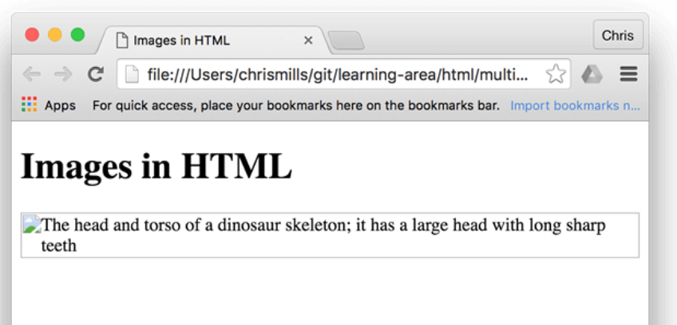


Entonces, ¿por qué verías o necesitarías un texto alternativo? Puede resultar útil por varias razones:

* El usuario tiene problemas de visión y utiliza un [lector de pantalla](https://en.wikipedia.org/wiki/Screen_reader) para leer la web. De hecho, disponer de texto alternativo para describir las imágenes resulta útil para la mayoría de los usuarios.

* Como se describió anteriormente, la ortografía del nombre del archivo o de la ruta podría ser incorrecta.

* El navegador no admite el tipo de imagen. Algunas personas aún utilizan navegadores que solo admiten texto, como [Lynx](https://en.wikipedia.org/wiki/Lynx_%28web_browser%29), que muestra el texto alternativo de las imágenes.

* Es posible que desee proporcionar texto para que lo utilicen los motores de búsqueda; por ejemplo, los motores de búsqueda pueden hacer coincidir el texto alternativo con las consultas de búsqueda.

* Los usuarios han desactivado las imágenes para reducir el volumen de transferencia de datos y las distracciones. Esto es especialmente habitual en los teléfonos móviles y en países donde el ancho de banda es limitado o caro.


¿Qué deberías escribir exactamente dentro de tu altatributo? Depende de por qué la imagen está ahí en primer lugar. En otras palabras, lo que pierdes si tu imagen no aparece:

* Decoración. Debes usar imágenes de fondo CSS para imágenes decorativas, pero si debes usar HTML, agrega un espacio en blanco `alt=""`.

* Contenido. Si la imagen proporciona información importante, proporcione la misma información en un texto breve alt o, mejor aún, en el texto principal que todos puedan ver. No escriba alttexto redundante.

* Enlace. Si coloca una imagen dentro `<a>` de etiquetas, para convertir una imagen en un enlace, debe proporcionar un texto de enlace accesible . En tales casos, puede escribirlo dentro del mismo `<a>` elemento o dentro del altatributo de la imagen, lo que funcione mejor en su caso.

* Texto. No debes incluir texto en imágenes. Si el encabezado principal necesita una sombra, por ejemplo, usa CSS para eso en lugar de incluir el texto en una imagen. Sin embargo, si realmente no puedes evitar hacerlo , debes incluir el texto dentro del `alt ` atributo.

Básicamente, la clave es ofrecer una experiencia utilizable, incluso cuando no se pueden ver las imágenes. Esto garantiza que los usuarios no se pierdan ningún contenido. Prueba a desactivar las imágenes en tu navegador y observa cómo se ven las cosas. Pronto te darás cuenta de lo útil que es el texto alternativo si no se puede ver la imagen.


# Ancho y alto
Puede utilizar los atributos `width` y `height` para especificar el ancho y la altura de su imagen. Se proporcionan como números enteros sin unidad y representan el ancho y la altura de la imagen en píxeles.

```html

  ```

Hay una muy buena razón para hacer esto. El HTML de su página y la imagen son recursos separados, obtenidos por el navegador como solicitudes HTTP(S) separadas. Tan pronto como el navegador haya recibido el HTML, comenzará a mostrárselo al usuario. Si las imágenes aún no se han recibido (y este será el caso a menudo, ya que los tamaños de los archivos de imagen suelen ser mucho más grandes que los archivos HTML), entonces el navegador solo mostrará el HTML y actualizará la página con la imagen tan pronto como la reciba.

Por ejemplo, supongamos que tenemos algún texto después de la imagen:

```html
<h1>Images in HTML</h1>


<blockquote>
  <p>
    But down there it would be dark now, and not the lovely lighted aquarium she
    imagined it to be during the daylight hours, eddying with schools of tiny,
    delicate animals floating and dancing slowly to their own serene currents
    and creating the look of a living painting. That was wrong, in any case. The
    ocean was different from an aquarium, which was an artificial environment.
    The ocean was a world. And a world is not art. Dorothy thought about the
    living things that moved in that world: large, ruthless and hungry. Like us
    up here.
  </p>
  <footer>- Rachel Ingalls, <cite>Mrs. Caliban</cite></footer>
</blockquote>
```

Tan pronto como el navegador descargue el HTML, comenzará a mostrar la página.

Una vez que se carga la imagen, el navegador la agrega a la página. Como la imagen ocupa espacio, el navegador debe mover el texto hacia abajo en la página para que quepa la imagen que está encima:

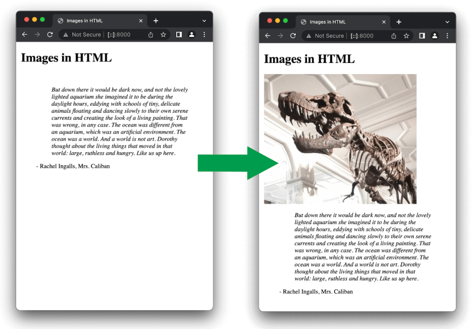

Mover el texto de esta manera distrae enormemente a los usuarios, especialmente si ya han comenzado a leerlo.

Si especifica el tamaño real de la imagen en su HTML, utilizando los atributos `width` y `height`, entonces el navegador sabe, antes de descargar la imagen, cuánto espacio tiene para ella.

Esto significa que una vez descargada la imagen, el navegador no tiene que mover el contenido circundante.

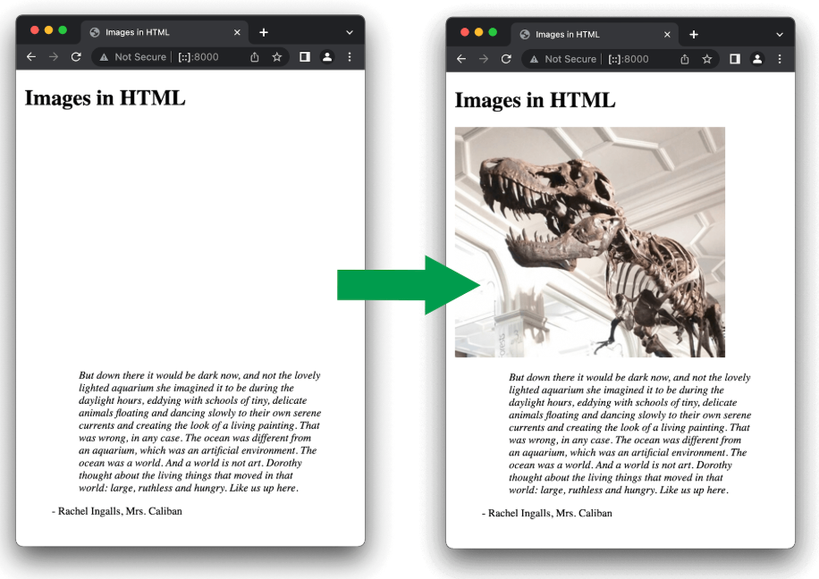

# Nota: Aunque, como hemos dicho, es una buena práctica especificar el tamaño real de las imágenes mediante atributos HTML, no debes usarlos para cambiar el tamaño de las imágenes.

> Si configura el tamaño de la imagen demasiado grande, obtendrá imágenes que se verán > granulosas, borrosas o demasiado pequeñas, y desperdiciará ancho de banda al 
> descargar una imagen que no se adapta a las necesidades del usuario. La imagen 
> también puede verse distorsionada si no mantiene la relación de aspecto correcta . 
> Debe usar un editor de imágenes para colocar la imagen en el tamaño correcto antes de > colocarla en su página web.

> Si necesita modificar el tamaño de una imagen, deberá utilizar [CSS](https://developer.mozilla.org/en-US/docs/Learn_web_development/Core/Styling_basics) .


# Títulos de imágenes
Al igual que con los enlaces , también puedes agregar titleatributos a las imágenes para brindar más información complementaria si es necesario. En nuestro ejemplo, podríamos hacer esto:

```html

```

Esto nos proporciona una información sobre herramientas al pasar el mouse, al igual que los títulos de los enlaces:


Sin embargo, esto no se recomienda, ya que titlepresenta varios problemas de accesibilidad, principalmente relacionados con el hecho de que la compatibilidad con lectores de pantalla es muy impredecible y la mayoría de los navegadores no la mostrarán a menos que pase el mouse por encima (por ejemplo, los usuarios que usan el teclado no tienen acceso).

Es mejor incluir dicha información de apoyo en el texto principal del artículo, en lugar de adjuntarla a la imagen.


# Anotación de imágenes con figuras y leyendas de figuras
Hablando de subtítulos, hay varias formas de agregar un subtítulo a tu imagen.

 utilizar los elementos HTML `<figure>` y HTML `<figcaption>`. Estos se crean exactamente con este fin: proporcionar un contenedor semántico para las figuras y vincular claramente la figura con el título.

```html
 <figure>
  

  <figcaption>
    A T-Rex on display in the Manchester University Museum.
  </figcaption>
</figure>
```

El `<figcaption>` elemento le dice a los navegadores y a la tecnología de asistencia que el título describe el resto del contenido del `<figure>` elemento.


# Nota: 
> desde el punto de vista de la accesibilidad, los subtítulos y `alt` el texto tienen 
> funciones distintas. Los subtítulos benefician incluso a las personas que pueden ver > la imagen, mientras que `alt` el texto proporciona la misma funcionalidad que una imagen > ausente. Por lo tanto, los subtítulos y `alt` el texto no deberían decir lo mismo, 
> porque ambos aparecen cuando la imagen desaparece.

Una figura no tiene por qué ser una imagen. Es una unidad de contenido independiente que:

* Expresa su significado de una manera compacta y fácil de entender.

* Podría ir en varios lugares en el flujo lineal de la página.

* Proporciona información esencial que respalda el texto principal.

Una figura puede ser varias imágenes, un fragmento de código, audio, vídeo, ecuaciones, una tabla o cualquier otra cosa.


# Vídeo y audio HTML
Ahora que ya nos sentimos cómodos añadiendo imágenes simples a una página web, el siguiente paso es empezar a añadir reproductores de vídeo y audio a los documentos HTML. En este artículo veremos cómo hacer exactamente eso con los elementos `<video>` y `<video>`; luego, terminaremos viendo cómo añadir subtítulos a los vídeos.


> Nota: Antes de comenzar, también debes saber que existen muchos proveedores de video en >> línea (OVP), como [YouTube](https://www.youtube.com/) , [Dailymotion](https://www.dailymotion.com/) y [Vimeo](https://vimeo.com/) , y proveedores de audio en línea, 
>> como [Soundcloud ](https://soundcloud.com/). Estas empresas ofrecen una forma cómoda y >> sencilla de alojar y 
>> consumir videos, por lo que no tienes que preocuparte por el enorme consumo de ancho >> de banda. Los OVP suelen ofrecer incluso un código listo para usar para incrustar 
>> video/audio en tus páginas web; si usas esa vía, puedes evitar algunas de las 
>> dificultades que analizamos en este artículo. Analizaremos este tipo de servicio un 
>> poco más en el próximo artículo.

# El elemento <video>
El `<video>` elemento permite insertar un vídeo de forma muy sencilla. Un ejemplo muy sencillo es el siguiente:

```html
<video src="rabbit320.webm" controls>
  <p>
    Your browser doesn't support HTML video. Here is a
    <a href="rabbit320.webm">link to the video</a> instead.
  </p>
</video>
```

Las características a tener en cuenta son:

* `src`
De la misma manera que en el caso del `` elemento, el srcatributo (fuente) contiene una ruta al vídeo que quieres incrustar. Funciona exactamente de la misma manera.

* `controls`
Los usuarios deben poder controlar la reproducción de video y audio (esto es especialmente importante para las personas que padecen epilepsia ). Debe utilizar el `controls` atributo para incluir la interfaz de control propia del navegador o crear su interfaz utilizando la API de JavaScript adecuada . Como mínimo, la interfaz debe incluir una forma de iniciar y detener el contenido multimedia y de ajustar el volumen.

El párrafo dentro de las `<video>` etiquetas
Esto se denomina contenido de respaldo : se mostrará si el navegador que accede a la página no admite el `<video>` elemento, lo que nos permite proporcionar un respaldo para navegadores más antiguos. Puede ser cualquier cosa que desee; en este caso, proporcionamos un enlace directo al archivo de video, para que el usuario pueda al menos acceder a él de alguna manera independientemente del navegador que esté usando.

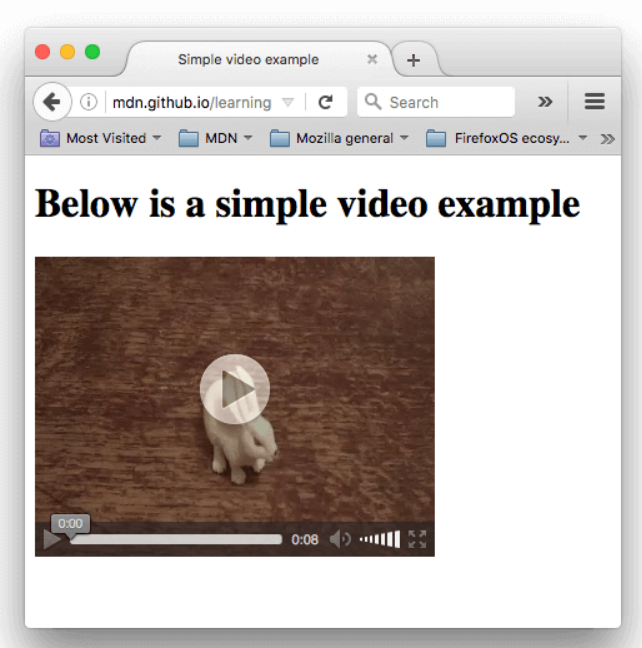


# Uso de múltiples formatos de origen para mejorar la compatibilidad
Hay un problema con el ejemplo anterior. Es posible que el video no se reproduzca porque los distintos navegadores admiten distintos formatos de video (y audio). Afortunadamente, hay cosas que puedes hacer para evitar que esto sea un problema.

# Contenido de un archivo multimedia
En primer lugar, repasemos rápidamente la terminología. Los formatos como MP3, MP4 y WebM se denominan [formatos contenedores](https://developer.mozilla.org/en-US/docs/Web/Media/Formats/Containers) . Definen una estructura en la que se almacenan las pistas de audio o vídeo que componen el medio, junto con metadatos que describen el medio, qué códecs se utilizan para codificar sus canales, etc.

Se puede conceptualizar un archivo WebM que contiene una película con una pista de video principal y una pista de ángulo alternativo, además de audio en inglés y español, además de audio para una pista de comentarios en inglés, como se muestra en el diagrama a continuación. También se incluyen pistas de texto que contienen subtítulos para el largometraje, subtítulos en español para la película y subtítulos en inglés para los comentarios.

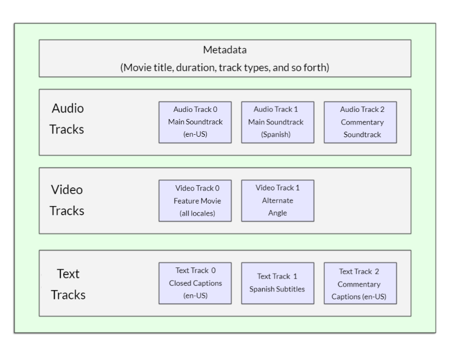

Las pistas de audio y vídeo dentro del contenedor contienen datos en el formato apropiado para el códec utilizado para codificar ese medio. Se utilizan diferentes formatos para pistas de audio y pistas de vídeo. Cada pista de audio se codifica utilizando un [códec de audio](https://developer.mozilla.org/en-US/docs/Web/Media/Formats/Audio_codecs) , mientras que las pistas de vídeo se codifican utilizando (como probablemente hayas adivinado) un [códec de vídeo](https://developer.mozilla.org/en-US/docs/Web/Media/Formats/Video_codecs) . Como hemos comentado antes, los distintos navegadores admiten distintos formatos de vídeo y audio, y distintos formatos de contenedor (como MP3, MP4 y WebM, que a su vez pueden contener distintos tipos de vídeo y audio).

Por ejemplo:

Un contenedor WebM generalmente empaqueta audio Vorbis u Opus con video VP8/VP9. Esto es compatible con todos los navegadores modernos, aunque es posible que las versiones anteriores no funcionen.
Un contenedor MP4 suele contener audio AAC o MP3 con vídeo H.264. Esto también es compatible con todos los navegadores modernos.
El contenedor Ogg suele utilizar audio Vorbis y video Theora. Este formato es compatible con Firefox y Chrome, pero ha sido reemplazado básicamente por el formato WebM de mejor calidad.
Existen algunos casos especiales. Por ejemplo, para algunos tipos de audio, los datos de un códec suelen almacenarse sin un contenedor o con un contenedor simplificado. Uno de esos casos es el códec FLAC, que se almacena con mayor frecuencia en archivos FLAC, que son simplemente pistas FLAC sin procesar.

Otra situación similar es la del siempre popular archivo MP3. Un "archivo MP3" es en realidad una pista de audio MPEG-1 Audio Layer III (MP3) almacenada en un contenedor MPEG o MPEG-2. Esto es especialmente interesante porque, si bien la mayoría de los navegadores no admiten el uso de medios MPEG en los elementos `<video>` y `<audio>`, es posible que sí admitan MP3 debido a su popularidad.

Un reproductor de audio tenderá a reproducir una pista de audio directamente, por ejemplo, un archivo MP3 u Ogg. Estos no necesitan contenedores.

Los códecs descritos en la sección anterior existen para comprimir el audio y el vídeo en archivos manejables, ya que tanto el audio como el vídeo sin procesar son extremadamente grandes. Cada navegador web admite una variedad de códecs , como Vorbis o H.264, que se utilizan para convertir el audio y el vídeo comprimidos en datos binarios y viceversa. Cada códec ofrece sus propias ventajas y desventajas, y cada contenedor también puede ofrecer sus propias características positivas y negativas que afectan a sus decisiones sobre cuál utilizar.

Una cosa más que hay que tener en cuenta: los navegadores móviles pueden admitir formatos adicionales que no son compatibles con sus equivalentes de escritorio, al igual que es posible que no admitan todos los mismos formatos que la versión de escritorio. Además, tanto los navegadores de escritorio como los móviles pueden estar diseñados para descargar la gestión de la reproducción de medios (ya sea para todos los medios o solo para tipos específicos que no pueden manejar internamente). Esto significa que la compatibilidad con medios depende en parte del software que tenga instalado el usuario.

¿Cómo lo hacemos? Eche un vistazo al siguiente ejemplo 

```html
<video controls>
  <source src="rabbit320.mp4" type="video/mp4" />
  <source src="rabbit320.webm" type="video/webm" />
  <p>
    Your browser doesn't support this video. Here is a
    <a href="rabbit320.mp4">link to the video</a> instead.
  </p>
</video>
```

Aquí hemos quitado el srcatributo de la `<video>` etiqueta real y, en su lugar, hemos incluido `<source>` elementos separados que apuntan a sus propias fuentes. En este caso, el navegador recorrerá los `<source>` elementos y reproducirá el primero que tenga el códec compatible. Incluir fuentes WebM y MP4 debería ser suficiente para reproducir su video en la mayoría de las plataformas y navegadores actuales.

Cada `<source>` elemento también tiene un `type` atributo. Esto es opcional, pero se recomienda que lo incluya. El `type` atributo contiene el [tipo MIME(https://developer.mozilla.org/en-US/docs/Glossary/MIME_type)] del archivo especificado por el `<source>`, y los navegadores pueden usarlo type para omitir inmediatamente los videos que no comprenden. Si `type` no se incluye, los navegadores cargarán e intentarán reproducir cada archivo hasta que encuentren uno que funcione, lo que obviamente lleva tiempo y es un uso innecesario de recursos.

# Otras funciones de `<video>`
Hay otras funciones que puedes incluir al mostrar un vídeo HTML. Observa nuestro siguiente ejemplo:

```html
<video
  controls
  width="400"
  height="400"
  autoplay
  loop
  muted
  preload="auto"
  poster="poster.png">
  <source src="rabbit320.mp4" type="video/mp4" />
  <source src="rabbit320.webm" type="video/webm" />
  <p>
    Your browser doesn't support this video. Here is a
    <a href="rabbit320.mp4">link to the video</a> instead.
  </p>
</video>
```

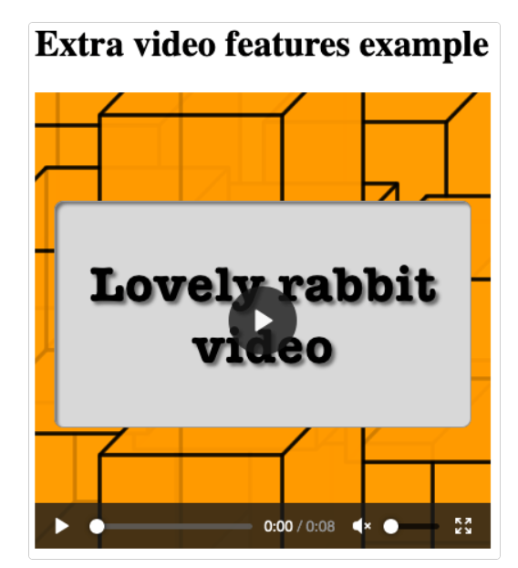

Las características incluyen:

* `width` y `height`
Puedes controlar el tamaño del video con estos atributos o con CSS . En ambos casos, los videos mantienen su relación de ancho y alto nativa, conocida como relación de aspecto . Si los tamaños que configuraste no mantienen la relación de aspecto, el video crecerá para llenar el espacio horizontalmente y el espacio sin llenar tendrá un color de fondo sólido de manera predeterminada.

* `autoplay`
Hace que el audio o el video comiencen a reproducirse inmediatamente, mientras se carga el resto de la página. Se recomienda no utilizar la reproducción automática de video (o audio) en sus sitios, ya que los usuarios pueden considerarla muy molesta.

* `loop`
Hace que el video (o audio) comience a reproducirse nuevamente cuando termina. Esto también puede resultar molesto, por lo que se debe usar solo si es realmente necesario.

* `muted`
Hace que el medio se reproduzca con el sonido desactivado de forma predeterminada.

* `poster`
La URL de una imagen que se mostrará antes de reproducir el vídeo. Está pensada para utilizarse en una pantalla de presentación o de publicidad.

* `preload`
Se utiliza para almacenar en búfer archivos grandes; puede tomar uno de tres valores:

* `"none"` no almacena en búfer el archivo
* `"auto"` almacena en búfer el archivo multimedia
* `"metadata"` almacena en búfer solo los metadatos del archivo

 Ten en cuenta que no hemos incluido el `autoplay` atributo en la versión en vivo: si el video comienza a reproducirse tan pronto como se carga la página, ¡no podrás ver el póster!

 # El elemento <audio>
El `<audio>` elemento funciona igual que el `<video>` elemento , con algunas pequeñas diferencias, como se describe a continuación. Un ejemplo típico podría ser el siguiente:

```html
<audio controls>
  <source src="viper.mp3" type="audio/mp3" />
  <source src="viper.ogg" type="audio/ogg" />
  <p>
    Your browser doesn't support this audio file. Here is a
    <a href="viper.mp3">link to the audio</a> instead.
  </p>
</audio>
```

Esto produce algo parecido a lo siguiente en un navegador:

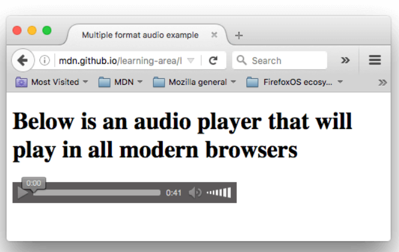

Ocupa menos espacio que un reproductor de vídeo, ya que no hay ningún componente visual: solo hay que mostrar los controles para reproducir el audio. Otras diferencias con el vídeo HTML son las siguientes:

* El `<audio>` elemento no admite los atributos` width/ height— `nuevamente, no hay ningún componente visual, por lo que no hay nada a qué asignar un ancho o alto.

* Tampoco admite el posteratributo: nuevamente, no tiene componente visual.

Aparte de esto, `<audio>` admite todas las mismas funciones: `<video>` revise las secciones anteriores para obtener más información sobre ellas.


# Visualización de pistas de texto de vídeo
Ahora vamos a hablar de un concepto un poco más avanzado que resulta muy útil conocer. Muchas personas no pueden o no quieren escuchar el contenido de audio o vídeo que encuentran en la Web, al menos en determinados momentos. Por ejemplo:

* Muchas personas tienen problemas auditivos (como dificultad auditiva o sordera), por lo que no pueden oír el audio con claridad o no pueden oírlo en absoluto.

* Es posible que otras personas no puedan escuchar el audio porque están en entornos ruidosos (como un bar lleno de gente cuando se transmite un partido deportivo).

* De manera similar, en entornos donde tener el audio reproducido sería una distracción o interrupción (como en una biblioteca o cuando una pareja está tratando de dormir), tener subtítulos puede ser muy útil.

* Las personas que no hablan el idioma del vídeo podrían querer una transcripción del texto o incluso una traducción para ayudarles a comprender el contenido multimedia.

¿No sería genial poder proporcionar a estas personas una transcripción de las palabras que se dicen en el audio o el vídeo? Pues bien, gracias al vídeo HTML, es posible hacerlo. Para ello, utilizamos el formato de archivo [WebVTT](https://developer.mozilla.org/en-US/docs/Web/API/WebVTT_API) `<track>` y el elemento.


> Nota: 
>> "Transcribir" significa "escribir palabras habladas como texto". El texto resultante es una "transcripción".

WebVTT es un formato para escribir archivos de texto que contienen múltiples cadenas de texto junto con metadatos como el momento del video en el que se debe mostrar cada cadena de texto e incluso información limitada sobre el estilo y la posición. Estas cadenas de texto se denominan señales y existen varios tipos de señales que se utilizan para diferentes propósitos. Las señales más comunes son:

subtítulos
* Traducciones de material extranjero, para personas que no entienden las palabras habladas en el audio.

subtítulos
* Transcripciones sincronizadas de diálogos o descripciones de sonidos significativos, para que las personas que no pueden escuchar el audio entiendan lo que está sucediendo.

descripciones cronometradas
* Texto que debe ser pronunciado por el reproductor multimedia para describir imágenes importantes para usuarios ciegos o con otras discapacidades visuales.

Un archivo WebVTT típico se verá así:


```html
WEBVTT

1
00:00:22.230 --> 00:00:24.606
This is the first subtitle.

2
00:00:30.739 --> 00:00:34.074
This is the second.

…
```

Para que esto se muestre junto con la reproducción multimedia HTML, debe:

Guárdelo como un `.vtt` archivo en algún lugar donde el servidor pueda servirlo (ver a continuación), como en el mismo directorio que el archivo HTML.

El enlace al `.vtt` archivo con el `<track>` elemento. `<track>` debe colocarse dentro de `<audio>` o `<video>`, pero después de todos `<source>` los elementos. Utilice el `kind` atributo para especificar si las señales son `subtitles`, `captionso o descriptions`. Además, utilice `srclang` para indicar al navegador en qué idioma ha escrito los subtítulos. Por último, añada `label` para ayudar a los lectores a identificar el idioma que están buscando.

He aquí un ejemplo:

```html
<video controls>
  <source src="example.mp4" type="video/mp4" />
  <source src="example.webm" type="video/webm" />
  <track kind="subtitles" src="subtitles_es.vtt" srclang="es" label="Spanish" />
</video>
```

Para probar esto, debes alojar los archivos en un [servidor HTTP local](https://developer.mozilla.org/en-US/docs/Learn_web_development/Howto/Tools_and_setup/set_up_a_local_testing_server) . En el resultado del navegador, verás un video con subtítulos, similar a esto:

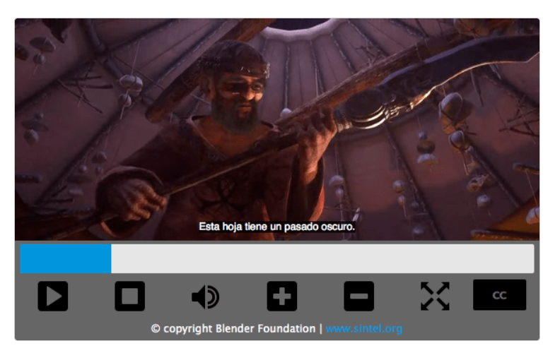

Para obtener más detalles, incluido cómo agregar etiquetas, lea [Cómo agregar subtítulos a videos HTML .](https://developer.mozilla.org/en-US/docs/Web/Media/Audio_and_video_delivery/Adding_captions_and_subtitles_to_HTML5_video) Puede [encontrar el ejemplo](https://iandevlin.github.io/mdn/video-player-with-captions/) que acompaña a este artículo en GitHub, escrito por Ian Devlin (vea también [el código fuente](https://github.com/iandevlin/iandevlin.github.io/tree/master/mdn/video-player-with-captions) ). Este ejemplo usa algo de JavaScript para permitir que los usuarios elijan entre diferentes subtítulos. Tenga en cuenta que para activar los subtítulos, debe presionar el botón "CC" y seleccionar una opción: inglés, alemán o español.


> Nota:
>> Las pistas de texto también te ayudan con el SEO , ya que los motores de búsqueda se >> benefician especialmente del texto. Las pistas de texto incluso permiten que los 
>> motores de búsqueda incluyan un enlace directo a un punto en la mitad del video.